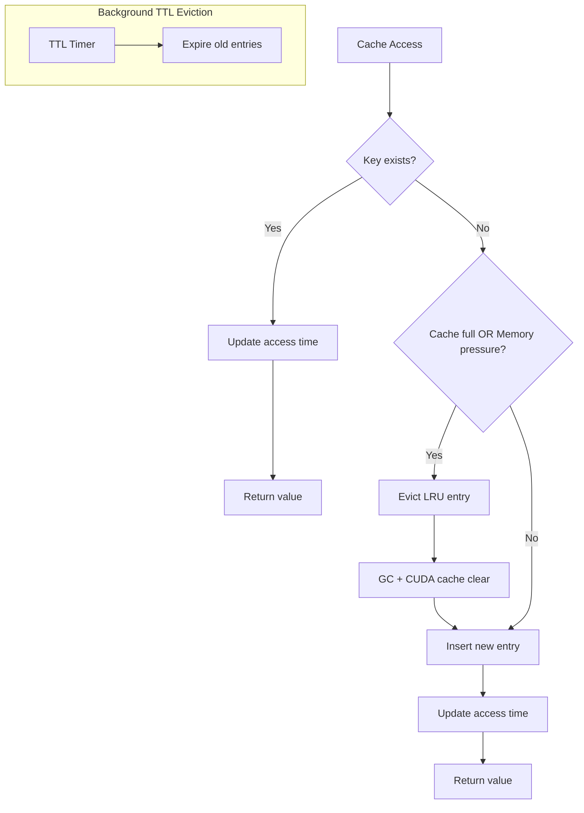
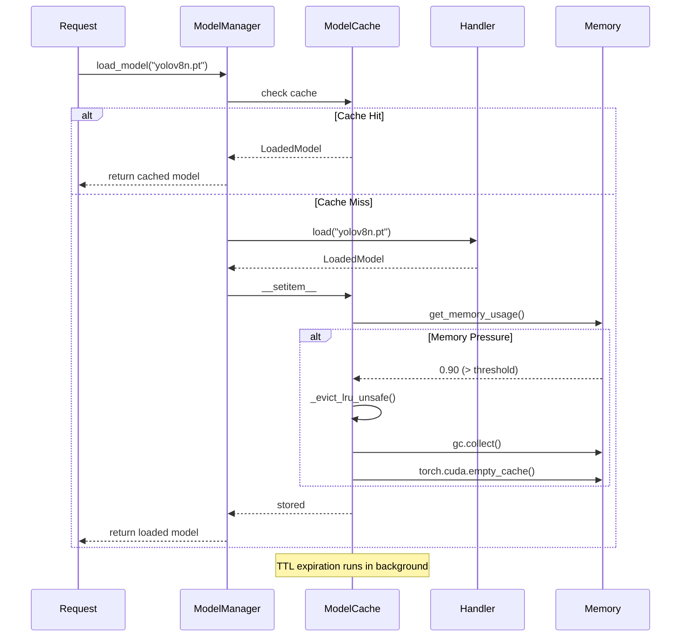

# Caching Strategy: TTL + LRU Hybrid Eviction

YOLO-Toys implements a sophisticated caching strategy combining TTL-based expiration with LRU eviction under memory pressure. This article explores the design decisions and implementation details.

## Problem Statement

Model loading is expensive:
- **YOLO models**: 0.1-2 seconds to load from disk
- **HuggingFace models**: 1-10 seconds (network download + deserialization)
- **GPU memory**: Limited resource, models can consume GBs

Naive caching strategies fail:
- **No cache**: Every request pays loading cost
- **Unbounded cache**: Memory exhaustion
- **TTL-only**: Doesn't account for memory pressure
- **LRU-only**: Popular models stay cached forever, consuming memory

**The challenge**: How do we balance responsiveness, memory usage, and fairness?

## Theoretical Foundation

### TTLCache (Time-To-Live)

TTLCache automatically evicts entries after a fixed duration, regardless of access patterns. This ensures:
- Stale models don't consume memory indefinitely
- Memory is eventually reclaimed
- Predictable upper bound on cache duration

### LRU (Least Recently Used)

LRU evicts the least recently accessed entry when capacity is reached. This ensures:
- Popular models stay cached
- Rarely used models are evicted first
- Bounded cache size

### Hybrid Approach

Our `ModelCache` combines both:



## Implementation Deep Dive

### ModelCache Class

```python
from cachetools import TTLCache
import threading
import time
import gc

class ModelCache(TTLCache):
    """TTL cache with memory monitoring and LRU eviction."""

    def __init__(
        self,
        maxsize: int,
        ttl: float,
        memory_threshold: float = 0.85
    ):
        super().__init__(maxsize=maxsize, ttl=ttl)
        self._access_times: dict[str, float] = {}
        self._lock = threading.Lock()
        self._memory_threshold = memory_threshold

    def __getitem__(self, key: str) -> Any:
        """Thread-safe get with access time tracking."""
        with self._lock:
            value = super().__getitem__(key)
            self._access_times[key] = time.time()
            return value

    def __setitem__(self, key: str, value: Any) -> None:
        """Thread-safe set with memory pressure check."""
        with self._lock:
            # Check eviction conditions
            if (len(self) >= self.maxsize or
                get_memory_usage() > self._memory_threshold):
                self._evict_lru_unsafe()

            super().__setitem__(key, value)
            self._access_times[key] = time.time()

    def _evict_lru_unsafe(self) -> None:
        """Evict least recently used entry (must hold lock)."""
        if not self._access_times:
            return

        # Find oldest entry
        oldest_key = min(
            self._access_times,
            key=lambda k: self._access_times[k]
        )

        logger.warning("Memory pressure, evicting: %s", oldest_key)

        # Remove from cache and tracking
        self.pop(oldest_key, None)
        self._access_times.pop(oldest_key, None)

        # Aggressive cleanup
        gc.collect()
        if torch.cuda.is_available():
            torch.cuda.empty_cache()
```

### Memory Monitoring

```python
def get_memory_usage() -> float:
    """Get current memory usage as ratio (0.0-1.0)."""
    try:
        import psutil
        return psutil.virtual_memory().percent / 100
    except ImportError:
        return 0.0  # Assume no pressure if psutil unavailable
```

### ModelManager Integration

```python
class ModelManager:
    def __init__(self, config: ModelManagerConfig | None = None):
        ...
        self._cache = ModelCache(
            maxsize=config.cache_maxsize,      # Default: 10
            ttl=config.cache_ttl,              # Default: 3600s (1 hour)
            memory_threshold=config.memory_threshold,  # Default: 0.85
        )

    def load_model(self, model_id: str) -> LoadedModel:
        """Load model with caching."""
        # Check cache first
        if model_id in self._cache:
            self._access_count[model_id] += 1
            return self._cache[model_id]

        # Load and cache
        start_time = time.time()
        handler = self._registry.get_handler(model_id)
        loaded = handler.load(model_id)
        load_time = time.time() - start_time

        self._cache[model_id] = loaded
        self._load_times[model_id] = load_time

        logger.info(
            "Model loaded: %s (handler=%s, load_time=%.2fs)",
            model_id, type(handler).__name__, load_time
        )

        return loaded
```

## Cache Lifecycle



## Configuration

Cache behavior is configurable via environment variables:

| Variable | Default | Description |
|----------|---------|-------------|
| `MODEL_CACHE_MAXSIZE` | 10 | Maximum cached models |
| `MODEL_CACHE_TTL` | 3600 | Time-to-live in seconds |
| `MODEL_MEMORY_THRESHOLD` | 0.85 | Memory pressure threshold (0.0-1.0) |

```python
# Example: More aggressive caching
export MODEL_CACHE_MAXSIZE=20
export MODEL_CACHE_TTL=7200  # 2 hours
export MODEL_MEMORY_THRESHOLD=0.75  # Evict at 75% memory
```

## Performance Analysis

### Cache Hit Rate

| Scenario | Expected Hit Rate | Latency Improvement |
|----------|-------------------|---------------------|
| Single model, repeated requests | >95% | 10-100x faster |
| Multi-model rotation (within cache) | ~80% | 5-50x faster |
| Multi-model rotation (exceeds cache) | ~50% | 2-10x faster |
| Random model selection | Low | Minimal |

### Memory Impact

```python
# Example memory profiles (approximate)
MODEL_SIZES = {
    "yolov8n.pt": "6 MB",
    "yolov8s.pt": "22 MB",
    "yolov8m.pt": "52 MB",
    "yolov8l.pt": "83 MB",
    "facebook/detr-resnet-50": "160 MB",
    "google/owlvit-base-patch32": "450 MB",
}
```

With `cache_maxsize=10` and mixed model usage:
- **Minimum memory**: ~60 MB (10 × yolov8n)
- **Maximum memory**: ~4.5 GB (10 × owlvit)
- **Memory threshold eviction** prevents exceeding system memory

## Trade-offs

### What We Gained

| Benefit | Description |
|---------|-------------|
| **Responsiveness** | Cached models load instantly |
| **Memory Safety** | Automatic eviction prevents OOM |
| **Fairness** | TTL ensures all models get refreshed |
| **Thread Safety** | Lock prevents race conditions |
| **Observability** | Cache stats available via API |

### What We Sacrificed

| Cost | Mitigation |
|------|------------|
| **Lock overhead** | Minimal (Python GIL already serializes) |
| **Memory monitoring cost** | psutil is very fast (~μs) |
| **GC pauses** | Only on eviction, infrequent |

### Alternative Considered: Weighted Cache

We considered weighting cache entries by model size:

```python
# Rejected approach
cache = LRUCache(maxsize_bytes=2_000_000_000)  # 2 GB limit
cache.set("owlvit", model, weight=450_000_000)
cache.set("yolov8n", model, weight=6_000_000)
```

**Why rejected**:
- Complex to implement correctly
- Model memory usage varies with device (CPU vs GPU)
- Simpler to use count-based limit + memory threshold

## Monitoring

### Cache Statistics API

```python
@property
def cache_info(self) -> dict[str, Any]:
    return {
        "cache_size": len(self._cache),
        "cache_maxsize": self._cache.maxsize,
        "cache_ttl": self._cache.ttl,
        "cached_models": list(self._cache.keys()),
        "memory_usage": get_memory_usage(),
    }
```

### Prometheus Metrics

```python
MODEL_CACHE_SIZE = Gauge("model_cache_size", "Cached models count")
MODEL_MEMORY_USAGE = Gauge("model_memory_usage_ratio", "Memory usage")
MODEL_LOAD_TIME = Gauge("model_load_duration_seconds", "Load time", ["model_id"])
```

### Example Monitoring Query

```promql
# Cache efficiency
rate(inference_requests_total[5m])
/
rate(model_load_duration_seconds_count[5m])

# Memory pressure alerts
model_memory_usage_ratio > 0.9
```

## Best Practices

### When to Increase Cache Size

- Many models accessed frequently
- Memory is abundant
- Load times are significant

### When to Decrease Cache Size

- Memory constrained environment
- Few models used
- Load times are acceptable

### When to Adjust TTL

- **Short TTL**: Models update frequently, or memory is tight
- **Long TTL**: Stable models, memory is abundant

### When to Adjust Memory Threshold

- **Low (0.7)**: Conservative, evict early
- **High (0.95)**: Aggressive, evict only near OOM

## Summary

The TTL + LRU hybrid caching strategy provides YOLO-Toys with:
- Fast response times through caching
- Memory safety through pressure-aware eviction
- Fairness through TTL expiration
- Thread safety for concurrent requests

The key insight is that neither TTL nor LRU alone is sufficient—we need both to balance responsiveness, memory usage, and fairness in a production environment.
