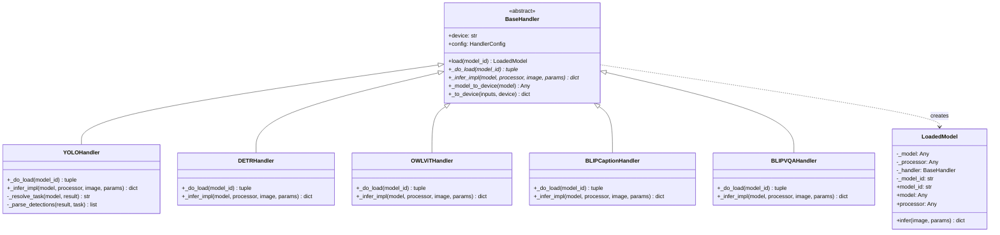
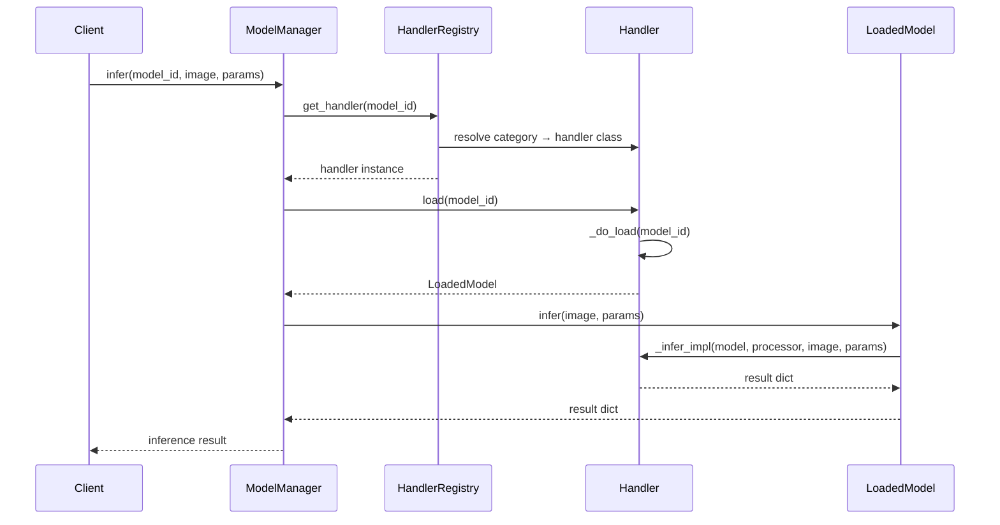

# Handler Pattern: A Deep Dive

The Handler Pattern is the cornerstone of YOLO-Toys' extensibility. This article explores how we use the Strategy pattern to achieve unified inference across eight distinct model families.

## Problem Statement

Modern vision applications require multiple model types:
- **Detection**: YOLOv8, DETR, OWL-ViT, Grounding DINO
- **Segmentation**: YOLOv8-seg
- **Pose Estimation**: YOLOv8-pose
- **Multimodal**: BLIP (captioning, VQA)

Each model family has different:
- Loading mechanisms (local `.pt` files vs. HuggingFace Hub)
- Preprocessing pipelines (OpenCV vs. PIL, normalization differences)
- Output formats (bounding boxes, masks, keypoints, text)
- Configuration requirements (device placement, precision settings)

**The challenge**: How do we provide a unified interface while respecting each model's unique characteristics?

## Theoretical Foundation

### Strategy Pattern (GoF)

The Strategy pattern defines a family of algorithms, encapsulates each one, and makes them interchangeable. In our context:



### Deep Module Principle

Following Sandi Metz's "Practical Object-Oriented Design," we apply the Deep Module principle:

> "The best modules are those whose interfaces are simple but whose implementations are complex."

Our `LoadedModel` class exemplifies this:
- **Interface**: Single `infer()` method
- **Implementation**: Hides model, processor, and handler coordination

## Implementation Deep Dive

### BaseHandler Abstract Class

```python
class BaseHandler(ABC):
    """All model handlers inherit from this interface."""

    def __init__(self, config: HandlerConfig | str | None = None):
        # Support multiple initialization patterns for flexibility
        if isinstance(config, str):
            self._device = config  # Backward compatibility
        else:
            self._device = config.device

    def load(self, model_id: str) -> LoadedModel:
        """Template method - loads and wraps model."""
        model, processor = self._do_load(model_id)
        return LoadedModel(model, processor, self, model_id)

    @abstractmethod
    def _do_load(self, model_id: str) -> tuple[Any, Any | None]:
        """Subclass hook for model loading."""
        ...

    @abstractmethod
    def _infer_impl(self, model, processor, image, params) -> dict:
        """Subclass hook for inference."""
        ...
```

### LoadedModel: The Deep Module

```python
class LoadedModel:
    """Encapsulates loaded model, hiding processor complexity."""

    def __init__(self, model, processor, handler, model_id):
        self._model = model
        self._processor = processor
        self._handler = handler
        self._model_id = model_id

    def infer(self, image: np.ndarray, params: InferenceParams) -> dict:
        """Single entry point - delegates to handler's implementation."""
        return self._handler._infer_impl(
            self._model, self._processor, image, params
        )
```

**Key insight**: Callers never need to know whether a processor exists or how to use it.

### YOLOHandler Example

```python
class YOLOHandler(BaseHandler):
    """Handles all YOLO series: detect, segment, pose."""

    def _do_load(self, model_id: str) -> tuple[Any, None]:
        # YOLO models don't need a separate processor
        from ultralytics import YOLO
        return YOLO(model_id), None

    def _infer_impl(self, model, processor, image, params) -> dict:
        t0 = time.time()

        # Extract YOLO-specific parameters
        yolo_kwargs = params.for_yolo()
        yolo_kwargs["device"] = params.device or self._device

        # Run inference
        results = model(image, **yolo_kwargs)

        # Parse results based on task type
        task = self._resolve_task(model, results[0])
        detections = self._parse_detections(results[0], task)

        return make_result(image, detections=detections,
                          inference_time=(time.time() - t0) * 1000,
                          task=task)
```

### HuggingFace Handler Example

```python
class DETRHandler(BaseHandler):
    """Facebook DETR - requires processor for pre/post processing."""

    def _do_load(self, model_id: str) -> tuple[Any, Any]:
        from transformers import DetrForObjectDetection, DetrImageProcessor

        processor = DetrImageProcessor.from_pretrained(model_id)
        model = DetrForObjectDetection.from_pretrained(model_id)
        model = self._model_to_device(model)

        return model, processor

    def _infer_impl(self, model, processor, image, params) -> dict:
        pil_image = self.bgr_to_pil(image)

        # Preprocess with processor
        inputs = processor(images=pil_image, return_tensors="pt")
        inputs = self._to_device(inputs)

        # Run inference
        with torch.no_grad():
            outputs = model(**inputs)

        # Post-process with processor
        target_sizes = torch.as_tensor([pil_image.size[::-1]])
        results = processor.post_process_object_detection(
            outputs, target_sizes=target_sizes, threshold=params.conf
        )[0]

        # Format detections
        detections = [
            {"bbox": box.tolist(), "score": float(score),
             "label": model.config.id2label[int(label)]}
            for score, label, box in zip(
                results["scores"], results["labels"], results["boxes"]
            )
        ]

        return make_result(image, detections=detections, ...)
```

## Request Flow



## Trade-offs

### What We Gained

| Benefit | Description |
|---------|-------------|
| **Extensibility** | Adding a new model requires only implementing `_do_load` and `_infer_impl` |
| **Testability** | Each handler can be unit tested in isolation |
| **Single Responsibility** | Each handler knows only its model family |
| **Open/Closed** | System is open for extension, closed for modification |

### What We Sacrificed

| Cost | Mitigation |
|------|------------|
| **Indirection** | Multiple layers between API and model | Clear naming and documentation |
| **Memory overhead** | Handler instances per category | Handler caching in registry |
| **Learning curve** | Developers must understand the pattern | This academy article |

### Alternative Considered: Factory Pattern

We considered using a Factory pattern where a central factory creates inference functions:

```python
# Rejected approach
def create_inferencer(model_id: str) -> Callable:
    if model_id.endswith(".pt"):
        return yolo_inferencer
    elif "detr" in model_id:
        return detr_inferencer
    ...
```

**Why rejected**: Factory creates objects but doesn't provide a shared abstraction for behavior. The Strategy pattern better encapsulates the "how" of inference, not just the "what".

## Extension Guide

### Adding a New Model Family

1. **Identify the category**: Where does your model fit?

```python
class ModelCategory(Enum):
    # Add new category if needed
    MY_NEW_TASK = auto()
```

2. **Create the handler**: Inherit from `BaseHandler`

```python
class MyNewHandler(BaseHandler):
    def _do_load(self, model_id: str) -> tuple[Any, Any | None]:
        # Load your model and processor
        ...

    def _infer_impl(self, model, processor, image, params) -> dict:
        # Implement inference logic
        ...
```

3. **Register the handler**: Add to category mapping

```python
_CATEGORY_HANDLER_MAP = {
    ...
    ModelCategory.MY_NEW_TASK: MyNewHandler,
}
```

4. **Add metadata**: Register your model

```python
MODEL_REGISTRY["my-model-id"] = {
    "category": ModelCategory.MY_NEW_TASK,
    "name": "My Model",
    "description": "...",
    ...
}
```

5. **Add parameter extraction** (if needed): Extend `InferenceParams`

```python
def for_my_new_model(self) -> dict[str, Any]:
    return {"custom_param": self.custom_param}
```

### Testing Your Handler

```python
import pytest
from app.handlers.my_new_handler import MyNewHandler

def test_handler_loads_model():
    handler = MyNewHandler(device="cpu")
    loaded = handler.load("my-model-id")
    assert loaded.model_id == "my-model-id"
    assert loaded.model is not None

def test_handler_infers_correctly():
    handler = MyNewHandler(device="cpu")
    loaded = handler.load("my-model-id")
    dummy_image = np.zeros((640, 640, 3), dtype=np.uint8)
    result = loaded.infer(dummy_image, InferenceParams())
    assert "inference_time" in result
    assert result["task"] == "my_task"
```

## Summary

The Handler Pattern provides YOLO-Toys with:
- A unified interface for diverse model families
- Clean separation of concerns
- Easy extensibility for new models
- Testable, maintainable code

The key insight is that the Strategy pattern, combined with Deep Module design, allows us to manage complexity without sacrificing flexibility.
