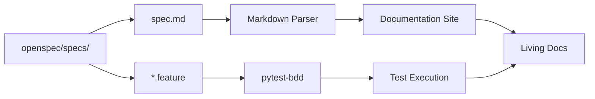
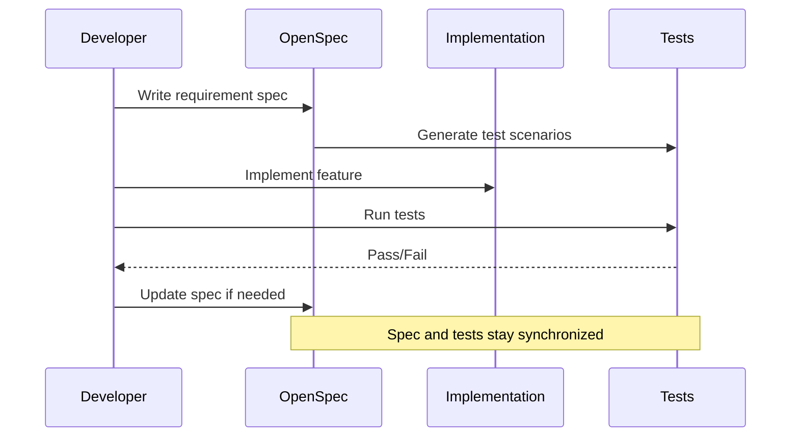

# OpenSpec System: Behavioral Specification

YOLO-Toys uses OpenSpec, a specification system based on Gherkin syntax, to define behavioral contracts. This article explores how this system improves documentation quality and development workflow.

## Problem Statement

Traditional documentation suffers from:
- **Drift**: Code changes but docs don't update
- **Ambiguity**: Natural language is imprecise
- **Fragmentation**: Specs scattered across READMEs, wikis, issues
- **No enforcement**: Nothing verifies docs match implementation

**The challenge**: How do we create living documentation that stays synchronized with code?

## Theoretical Foundation

### Gherkin Syntax

Gherkin is a domain-specific language for behavioral specification, popularized by Cucumber:

```gherkin
Feature: Feature Name
  As a [role]
  I want [feature]
  So that [benefit]

  Scenario: Scenario Name
    Given [precondition]
    When [action]
    Then [expected result]
```

Key characteristics:
- **Structured**: Machine-parseable format
- **Readable**: Non-technical stakeholders can understand
- **Testable**: Can be executed as automated tests
- **Living**: Version-controlled alongside code

### OpenSpec Conventions

OpenSpec adapts Gherkin for API specification:

```markdown
## Purpose

Define the [domain] contract.

---

### Requirement: Requirement Name

The system MUST [behavioral constraint].

#### Scenario: Scenario Name
Given: [precondition]
When: [action]
Then: [expected result]
```

## Implementation Deep Dive

### Directory Structure

```
openspec/
├── config.yaml                 # OpenSpec configuration
├── specs/
│   ├── api/
│   │   ├── spec.md            # REST API specification
│   │   ├── openapi.yaml       # OpenAPI schema
│   │   └── websocket.md       # WebSocket protocol
│   ├── domain/
│   │   └── spec.md            # Domain model specification
│   ├── testing/
│   │   ├── spec.md            # Testing strategy
│   │   └── rest-api.feature   # Gherkin test scenarios
│   └── product/
│       └── spec.md            # Product requirements
└── changes/
    ├── archive/               # Completed changes
    └── active/                # Work in progress
```

### API Specification Example

```markdown
## Purpose

Define the REST API contract for the YOLO-Toys inference platform.

---

### Requirement: Health Check Endpoint

The system MUST provide a `/health` endpoint that returns service status.

#### Scenario: Service is healthy
Given: The FastAPI application is running
When: A GET request is made to `/health`
Then: Response status is 200 with `{ "status": "ok", "version": "...", "device": "..." }`

---

### Requirement: Inference Endpoint

The system MUST provide a `/infer` endpoint for detection, segmentation, and pose tasks.

#### Scenario: Successful object detection
Given: A valid image file and model_id for detection
When: A POST request is made to `/infer` with the image
Then: Response contains `width`, `height`, `task: "detect"`, `detections` array

#### Scenario: Invalid image format
Given: An invalid file (not an image)
When: A POST request is made to `/infer`
Then: Response status is 400 with error detail
```

### Domain Specification Example

```markdown
## Purpose

Define the core architecture patterns for YOLO-Toys.

---

### Requirement: Handler Pattern (Strategy)

The system MUST implement all model inference through a unified `BaseHandler` interface.

#### Scenario: Load and cache model
Given: A model_id is requested for inference
When: The handler's `load()` method is called
Then: Model is loaded, cached, and returned with optional processor

#### Scenario: Execute inference
Given: A model is loaded and cached
When: The handler's `infer()` method is called with an image
Then: Results are returned in the standard format for the task type
```

### Gherkin Test Scenarios

```gherkin
Feature: REST API Inference
  As a user
  I want to perform inference on images via REST API
  So that I can detect objects in my images

  Background:
    Given the server is running on port 8000
    And the default model is yolov8n.pt

  Scenario: Successful detection inference
    Given I have a valid image file "test.jpg"
    When I send a POST request to "/infer" with:
      | field   | value      |
      | file    | test.jpg   |
      | model   | yolov8n.pt |
      | conf    | 0.25       |
    Then the response status should be 200
    And the response should contain "width"
    And the response should contain "height"
    And the response should contain "task" with value "detect"
    And the response should contain "detections" as an array

  Scenario Outline: Open-vocabulary detection
    Given I have a valid image file "test.jpg"
    When I send a POST request to "/infer" with:
      | field        | value          |
      | file         | test.jpg       |
      | model        | <model>        |
      | text_queries | "cat, dog"     |
    Then the response status should be 200

    Examples:
      | model                          |
      | google/owlvit-base-patch32     |
      | IDEA-Research/grounding-dino-tiny |
```

## Specification as Documentation

### Dual Purpose

OpenSpec files serve as both:
1. **Documentation**: Humans read markdown specs
2. **Tests**: Tools execute Gherkin scenarios

### Documentation Generation



## Workflow Integration

### Development Workflow



### Change Management

OpenSpec includes a change management system:

```
openspec/changes/
├── active/
│   └── 2026-05-15-add-sam-support/
│       ├── proposal.md
│       ├── design.md
│       └── tasks.md
└── archive/
    └── 2026-04-24-normalize-project/
        ├── proposal.md
        └── tasks.md
```

Each change follows a structured process:
1. **Propose**: Create proposal with rationale
2. **Design**: Document technical approach
3. **Tasks**: Break down implementation steps
4. **Archive**: Move to archive when complete

## Trade-offs

### What We Gained

| Benefit | Description |
|---------|-------------|
| **Living Documentation** | Specs version-controlled with code |
| **Testability** | Gherkin scenarios executable as tests |
| **Precision** | Structured format reduces ambiguity |
| **Traceability** | Requirements linked to implementation |
| **Reviewability** | Changes visible in PRs |

### What We Sacrificed

| Cost | Mitigation |
|------|------------|
| **Learning Curve** | Gherkin syntax takes practice | Clear examples and templates |
| **Maintenance Overhead** | Specs need updating with code | Part of Definition of Done |
| **Tooling Complexity** | Need pytest-bdd, parsers | Worth it for the benefits |

### Alternative Considered: Traditional Docs

We considered using only markdown documentation:

```markdown
# API Reference

## POST /infer

Accepts an image file and returns detection results.

Parameters:
- `model`: Model ID (default: yolov8n.pt)
- `conf`: Confidence threshold
...
```

**Why rejected**:
- No structural enforcement
- Easy for docs to drift from implementation
- No automatic verification

## Best Practices

### Writing Good Scenarios

1. **Focus on behavior, not implementation**:
   ```gherkin
   # Good: What the system does
   Then the response contains "detections" as an array

   # Bad: How it does it
   Then the YOLOHandler is called with the image
   ```

2. **Use scenario outlines for variations**:
   ```gherkin
   Scenario Outline: Detection with different models
     When I send a request with model "<model>"
     Then the response status is 200

     Examples:
       | model        |
       | yolov8n.pt   |
       | yolov8s.pt   |
       | yolov8m.pt   |
   ```

3. **Keep scenarios independent**:
   - Each scenario should run in isolation
   - No dependency between scenarios

### Organizing Specifications

1. **One spec per domain**: API, Domain, Testing, etc.
2. **Group by feature**: Health, Inference, Models
3. **Use consistent terminology**: Match codebase naming

## Integration with Testing

### pytest-bdd Integration

```python
# test_api.py
from pytest_bdd import scenario, given, when, then

@scenario("rest-api.feature", "Successful detection inference")
def test_detection_inference():
    pass

@given("I have a valid image file")
def valid_image():
    return load_test_image("test.jpg")

@when("I send a POST request to /infer")
def send_inference_request(valid_image):
    return client.post("/infer", files={"file": valid_image})

@then("the response status should be 200")
def check_status(send_inference_request):
    assert send_inference_request.status_code == 200
```

## Summary

The OpenSpec system provides YOLO-Toys with:
- Living documentation that evolves with code
- Executable specifications for verification
- Structured change management
- Traceability from requirements to implementation

The key insight is that documentation shouldn't be separate from code—it should be a first-class artifact that undergoes the same rigor as implementation.
