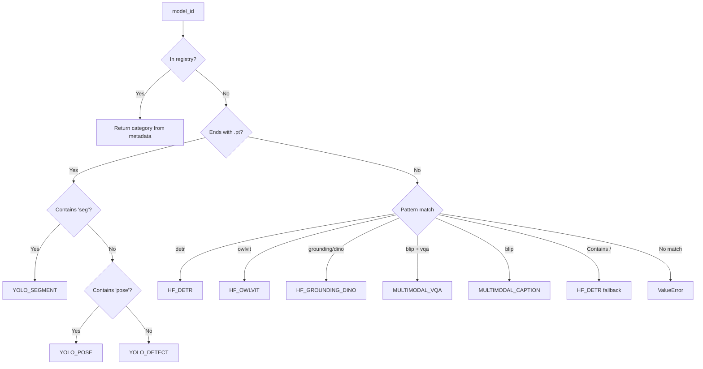

# Registry Pattern: Centralized Metadata Management

The Registry Pattern provides a single source of truth for model metadata, enabling automatic model discovery, category inference, and consistent API responses.

## Problem Statement

When supporting multiple model families, we need answers to:
- What models are available?
- What category does a model belong to?
- What handler should process this model?
- What metadata (name, description, speed, accuracy) should we display?

Without a registry, this logic would be scattered across:
- Route handlers (for `/models` endpoint)
- Model manager (for handler resolution)
- Configuration files
- Frontend code

**The challenge**: How do we centralize this knowledge while keeping it extensible?

## Theoretical Foundation

### Registry Pattern

The Registry pattern provides a lookup service for objects. It's a specialized form of the Repository pattern focused on read-heavy, lookup-intensive scenarios.

```mermaid
classDiagram
    class ModelCategory {
        <<enumeration>>
        YOLO_DETECT
        YOLO_SEGMENT
        YOLO_POSE
        HF_DETR
        HF_OWLVIT
        HF_GROUNDING_DINO
        MULTIMODAL_CAPTION
        MULTIMODAL_VQA
        +display_name: str
        +value_str: str
        +infer_from_id(model_id, registry)$ ModelCategory
    }

    class MODEL_REGISTRY {
        <<constant>>
        +dict~str, dict~
    }

    class HandlerRegistry {
        -_config_or_device: HandlerConfig | str
        -_handler_cache: dict
        +get_handler(model_id) BaseHandler
        -_resolve_category(model_id) ModelCategory
    }

    class "get_available_models()" as get_models {
        +returns: dict~str, dict~
    }

    class "get_model_info()" as get_info {
        +returns: dict | None
    }

    ModelCategory --> MODEL_REGISTRY : uses
    HandlerRegistry --> ModelCategory : resolves via
    get_models --> MODEL_REGISTRY : queries
    get_info --> MODEL_REGISTRY : queries
```

### Deep Module: ModelCategory

The `ModelCategory` enum exemplifies Deep Module design:
- **Interface**: Enum values + `infer_from_id()` class method
- **Implementation**: Encapsulates all inference rules and fallback logic

## Implementation Deep Dive

### ModelCategory Enumeration

```python
class ModelCategory(Enum):
    """Model category enumeration with inference capabilities."""

    YOLO_DETECT = auto()
    YOLO_SEGMENT = auto()
    YOLO_POSE = auto()
    HF_DETR = auto()
    HF_OWLVIT = auto()
    HF_GROUNDING_DINO = auto()
    MULTIMODAL_CAPTION = auto()
    MULTIMODAL_VQA = auto()

    @classmethod
    def infer_from_id(cls, model_id: str, registry: dict | None = None) -> "ModelCategory":
        """
        Infer category from model ID.

        Priority:
        1. Explicit registry lookup
        2. File extension inference (.pt → YOLO)
        3. String pattern matching (detr, owlvit, etc.)
        4. Fallback heuristics
        """
        # Priority 1: Registry lookup
        if registry and model_id in registry:
            cat = registry[model_id].get("category")
            if isinstance(cat, cls):
                return cat

        # Priority 2: YOLO .pt files
        if model_id.endswith(".pt"):
            lower = model_id.lower()
            if "seg" in lower:
                return cls.YOLO_SEGMENT
            if "pose" in lower:
                return cls.YOLO_POSE
            return cls.YOLO_DETECT

        # Priority 3: HuggingFace pattern matching
        lower = model_id.lower()
        if "detr" in lower:
            return cls.HF_DETR
        if "owlvit" in lower:
            return cls.HF_OWLVIT
        if "grounding" in lower or "dino" in lower:
            return cls.HF_GROUNDING_DINO
        if "blip" in lower and "vqa" in lower:
            return cls.MULTIMODAL_VQA
        if "blip" in lower:
            return cls.MULTIMODAL_CAPTION

        # Priority 4: Fallback for HuggingFace org/model format
        if "/" in model_id:
            return cls.HF_DETR

        raise ValueError(f"Unknown model: {model_id}")

    @property
    def display_name(self) -> str:
        """Human-readable category name."""
        names = {
            self.YOLO_DETECT: "YOLO Detection",
            self.YOLO_SEGMENT: "YOLO Segmentation",
            self.YOLO_POSE: "YOLO Pose",
            self.HF_DETR: "DETR Detection",
            self.HF_OWLVIT: "Open-Vocabulary Detection",
            self.HF_GROUNDING_DINO: "Grounding DINO",
            self.MULTIMODAL_CAPTION: "Image Captioning",
            self.MULTIMODAL_VQA: "Visual Question Answering",
        }
        return names.get(self, str(self))
```

### MODEL_REGISTRY Constant

```python
MODEL_REGISTRY: dict[str, dict[str, Any]] = {
    # YOLO Detection
    "yolov8n.pt": {
        "category": ModelCategory.YOLO_DETECT,
        "name": "YOLOv8 Nano",
        "description": "Ultra-lightweight detection model, fastest for real-time",
        "speed": "extreme fast",
        "accuracy": "medium",
    },
    "yolov8s.pt": {
        "category": ModelCategory.YOLO_DETECT,
        "name": "YOLOv8 Small",
        "description": "Lightweight detection model, balanced speed/accuracy",
        "speed": "fast",
        "accuracy": "good",
    },
    # ... more models

    # Open-Vocabulary Detection
    "google/owlvit-base-patch32": {
        "category": ModelCategory.HF_OWLVIT,
        "name": "OWL-ViT Base",
        "description": "Open-vocabulary detection, any text query",
        "speed": "medium",
        "accuracy": "high",
    },

    # Multimodal
    "Salesforce/blip-image-captioning-base": {
        "category": ModelCategory.MULTIMODAL_CAPTION,
        "name": "BLIP Caption Base",
        "description": "Image captioning model",
        "speed": "medium",
        "accuracy": "high",
    },
}
```

### HandlerRegistry Class

```python
# Category → Handler class mapping
_CATEGORY_HANDLER_MAP = {
    ModelCategory.YOLO_DETECT: YOLOHandler,
    ModelCategory.YOLO_SEGMENT: YOLOHandler,
    ModelCategory.YOLO_POSE: YOLOHandler,
    ModelCategory.HF_DETR: DETRHandler,
    ModelCategory.HF_OWLVIT: OWLViTHandler,
    ModelCategory.HF_GROUNDING_DINO: GroundingDINOHandler,
    ModelCategory.MULTIMODAL_CAPTION: BLIPCaptionHandler,
    ModelCategory.MULTIMODAL_VQA: BLIPVQAHandler,
}

class HandlerRegistry:
    """Handler registry - resolves model ID to handler instance."""

    def __init__(self, config_or_device: "HandlerConfig | str"):
        self._config_or_device = config_or_device
        self._handler_cache: dict[str, BaseHandler] = {}

    def get_handler(self, model_id: str) -> BaseHandler:
        """Get handler instance for model (with caching)."""
        category = self._resolve_category(model_id)
        handler_cls = _CATEGORY_HANDLER_MAP.get(category)

        if handler_cls is None:
            raise ValueError(f"Unknown model category for {model_id}")

        cls_name = handler_cls.__name__
        if cls_name not in self._handler_cache:
            self._handler_cache[cls_name] = handler_cls(self._config_or_device)

        return self._handler_cache[cls_name]

    def _resolve_category(self, model_id: str) -> ModelCategory:
        """Delegate to ModelCategory.infer_from_id."""
        return ModelCategory.infer_from_id(model_id, MODEL_REGISTRY)
```

### Utility Functions

```python
def get_available_models() -> dict[str, dict[str, Any]]:
    """Get all available models, grouped by category."""
    categories: dict[ModelCategory, dict[str, Any]] = {}

    # Initialize empty categories
    for cat in ModelCategory:
        categories[cat] = {"name": cat.display_name, "models": []}

    # Populate with registry data
    for model_id, info in MODEL_REGISTRY.items():
        cat = info.get("category")
        if cat in categories:
            categories[cat]["models"].append({
                "id": model_id,
                "name": info.get("name", model_id),
                "description": info.get("description", ""),
                "speed": info.get("speed", ""),
                "accuracy": info.get("accuracy", ""),
            })

    # Filter empty categories and convert to serializable format
    return {
        cat.value_str: data
        for cat, data in categories.items()
        if data["models"]
    }

def get_model_info(model_id: str) -> dict[str, Any] | None:
    """Get metadata for specific model."""
    return MODEL_REGISTRY.get(model_id)
```

## Category Resolution Flow



## Trade-offs

### What We Gained

| Benefit | Description |
|---------|-------------|
| **Single Source of Truth** | All model metadata in one place |
| **Automatic Discovery** | API endpoints can query registry dynamically |
| **Flexible Resolution** | Multiple inference strategies for unknown models |
| **Type Safety** | Enum prevents invalid categories |
| **Backward Compatibility** | `value_str` property supports legacy string-based code |

### What We Sacrificed

| Cost | Mitigation |
|------|------------|
| **Centralization** | Changes must go through registry | Simple dict structure, easy to extend |
| **Runtime Discovery** | Cannot add models without code change | Support for ad-hoc `.pt` files |
| **Enum Rigidity** | Adding categories requires code change | Acceptable for stable model families |

### Alternative Considered: Distributed Metadata

We considered storing metadata alongside each handler:

```python
# Rejected approach
class YOLOHandler(BaseHandler):
    MODELS = {
        "yolov8n.pt": {"name": "YOLOv8 Nano", ...},
        "yolov8s.pt": {"name": "YOLOv8 Small", ...},
    }
```

**Why rejected**:
- Difficult to get a complete model list (need to query all handlers)
- Category information would be scattered
- Harder to maintain consistency

## Extension Guide

### Adding a New Model to Existing Category

```python
# In models_metadata.py
MODEL_REGISTRY["yolov8x.pt"] = {
    "category": ModelCategory.YOLO_DETECT,
    "name": "YOLOv8 XLarge",
    "description": "Extra-large detection model, highest accuracy",
    "speed": "slow",
    "accuracy": "highest",
}
```

### Adding a New Category

1. Add enum value:

```python
class ModelCategory(Enum):
    ...
    MY_NEW_CATEGORY = auto()
```

2. Update display names and value_str mappings

3. Create the handler:

```python
class MyNewHandler(BaseHandler):
    ...
```

4. Add to category-handler mapping:

```python
_CATEGORY_HANDLER_MAP[ModelCategory.MY_NEW_CATEGORY] = MyNewHandler
```

5. Add inference logic in `infer_from_id()`

### Supporting Dynamic Model Discovery

For truly dynamic models (e.g., user-uploaded `.pt` files), the registry automatically handles them:

```python
# Any .pt file is inferred as YOLO
model_id = "my-custom-model.pt"
category = ModelCategory.infer_from_id(model_id, MODEL_REGISTRY)
# → ModelCategory.YOLO_DETECT (or YOLO_SEGMENT/POSE if name contains keywords)
```

## Summary

The Registry Pattern provides YOLO-Toys with:
- Centralized, maintainable model metadata
- Flexible category inference with multiple fallback strategies
- Clean separation between model discovery and model usage
- Single source of truth for API responses

Combined with the Handler Pattern, it creates a clean architecture where:
- **Registry** handles "what" (model existence, metadata)
- **Handler** handles "how" (model loading, inference)
