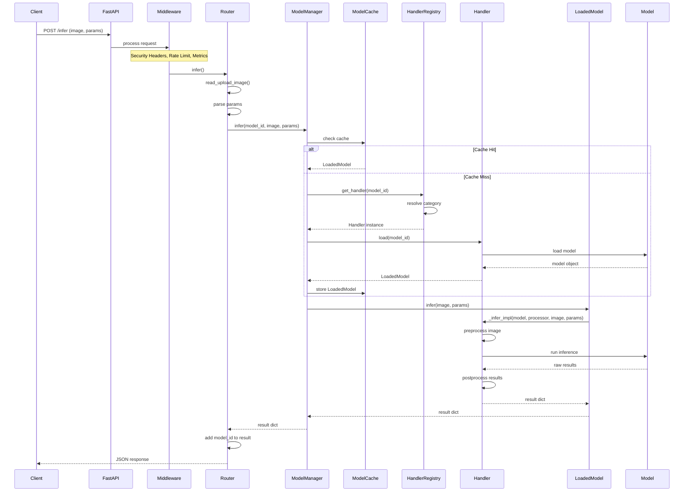
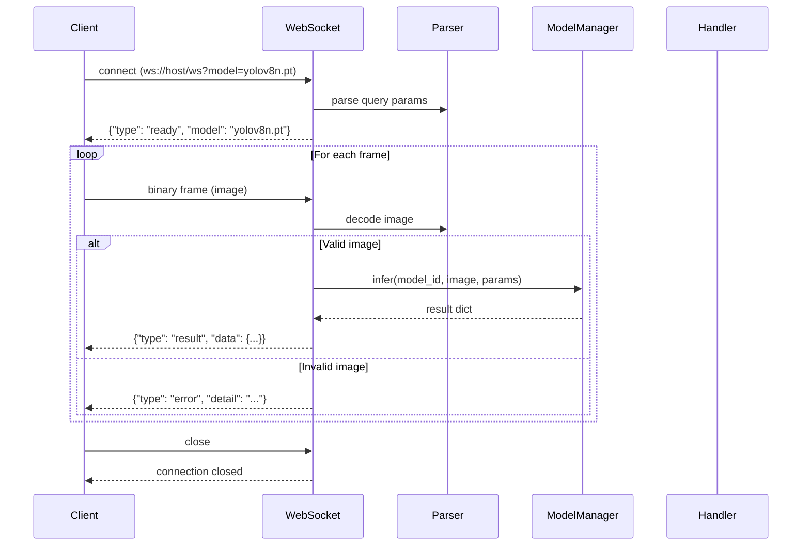
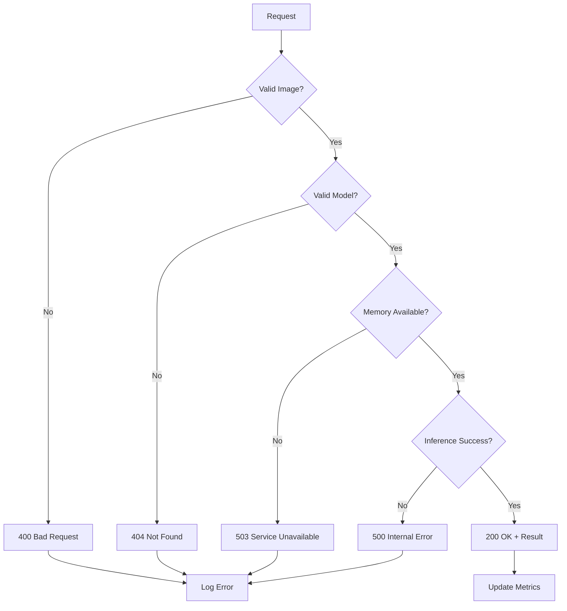

# Request Flow: End-to-End Processing

This document traces a complete inference request from HTTP receipt to response, showing how each component participates.

## High-Level Flow



## Detailed Component Flow

### 1. HTTP Request Reception

```python
# app/api/inference.py
@router.post("/infer")
async def infer(
    file: UploadFile,
    model: str | None = None,
    conf: float | None = None,
    ...
):
    # Semaphore for concurrency control
    async with semaphore:
        result = await asyncio.to_thread(
            model_manager.infer,
            model_id=model_id,
            image=img,
            ...
        )
```

### 2. Middleware Chain

```python
# app/main.py
app.add_middleware(SecurityHeadersMiddleware)
app.add_middleware(MetricsMiddleware)
app.add_middleware(TimeoutMiddleware)
app.add_middleware(RateLimitMiddleware)
app.add_middleware(GZipMiddleware)
app.add_middleware(CORSMiddleware)
```

**Order matters**: Added first, executed last (wraps subsequent middleware).

### 3. Image Processing

```python
# app/api/utils.py
async def read_upload_image(file: UploadFile) -> tuple[np.ndarray, int]:
    content = await file.read()
    nparr = np.frombuffer(content, np.uint8)
    image = cv2.imdecode(nparr, cv2.IMREAD_COLOR)  # BGR format
    return image, len(content)
```

### 4. Model Resolution

```python
# app/model_manager.py
def load_model(self, model_id: str) -> LoadedModel:
    if model_id in self._cache:
        return self._cache[model_id]

    handler = self._registry.get_handler(model_id)
    loaded = handler.load(model_id)
    self._cache[model_id] = loaded
    return loaded
```

### 5. Handler Resolution

```python
# app/handlers/registry.py
def get_handler(self, model_id: str) -> BaseHandler:
    category = ModelCategory.infer_from_id(model_id, MODEL_REGISTRY)
    handler_cls = _CATEGORY_HANDLER_MAP[category]
    return handler_cls(self._config_or_device)
```

### 6. Model Loading

```python
# app/handlers/base.py
def load(self, model_id: str) -> LoadedModel:
    model, processor = self._do_load(model_id)
    return LoadedModel(model, processor, self, model_id)
```

### 7. Inference Execution

```python
# app/handlers/base.py (LoadedModel)
def infer(self, image: np.ndarray, params: InferenceParams) -> dict:
    return self._handler._infer_impl(
        self._model, self._processor, image, params
    )
```

### 8. Result Formatting

```python
# app/handlers/utils.py
def make_result(image, *, detections, inference_time, task, **extra):
    h, w = image.shape[:2]
    return {
        "width": w,
        "height": h,
        "inference_time": inference_time,
        "task": task,
        "detections": detections,
        **extra
    }
```

## WebSocket Flow



## Error Handling Flow



## Timing Breakdown

| Phase | Typical Duration | Notes |
|-------|------------------|-------|
| HTTP parsing | < 1ms | FastAPI overhead |
| Image decode | 1-10ms | Depends on size |
| Cache lookup | < 1ms | Dict access |
| Model load | 100ms - 10s | First load only |
| Preprocessing | 1-50ms | Model-specific |
| Inference | 10ms - 1s | GPU/CPU dependent |
| Postprocessing | 1-10ms | Format conversion |
| JSON encode | < 1ms | Response size dependent |

## Metrics Collection

Each request updates Prometheus metrics:

```python
INFERENCE_REQUESTS.labels(model, task, status).inc()
INFERENCE_LATENCY.labels(model, task).observe(duration)
INFERENCE_INPUT_SIZE.observe(file_size)
```

Access metrics at `/metrics` endpoint for Prometheus scraping.
