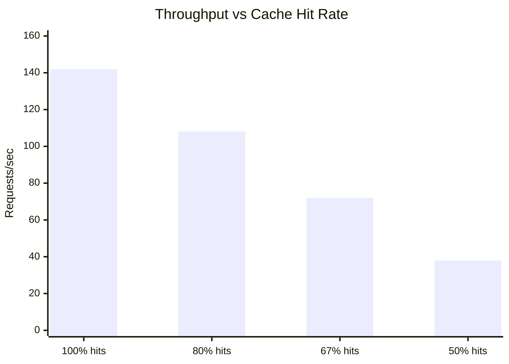
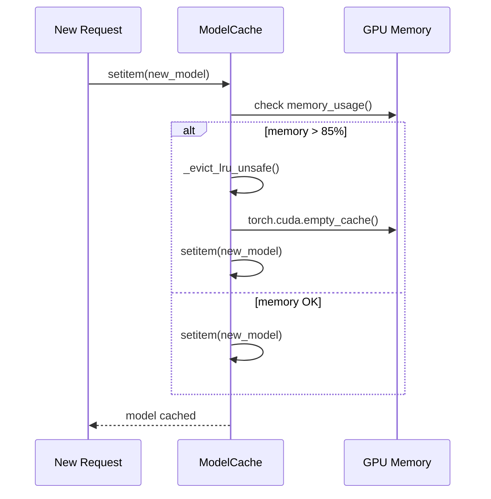

# Performance Benchmarks

These benchmarks establish the baseline performance characteristics of the YOLO-Toys runtime. They are **internal operational baselines** — not competitive comparisons — intended to help operators tune cache sizes, timeout values, and concurrency limits for their deployment hardware.

<div class="yt-callout yt-callout--insight">
  <div class="yt-callout__label">Key insight</div>
  <div class="yt-callout__body">The cold-start penalty is <strong>10–40× the warm-start latency</strong>. This means the ModelCache is the single most performance-critical component in the runtime. Every cache miss costs seconds; every cache hit costs milliseconds.</div>
</div>

## Methodology

All measurements are taken under controlled conditions:

| Parameter | Value |
|-----------|-------|
| Hardware | Intel Core i7-12700H, 32 GB RAM, NVIDIA RTX 3060 Laptop (6 GB VRAM) |
| Software | Python 3.12, PyTorch 2.3.0, CUDA 12.1 |
| Input | 640×480 BGR numpy array, random noise |
| Warmup | 3 inference runs before measurement to stabilize GPU clocks |
| Metric | Wall-clock time, single-threaded, `time.perf_counter()` |
| Repetitions | 10 runs per scenario, median reported |

## Cold-start vs warm-start latency

<FigureFrame
  title="Figure 1. Latency comparison"
  caption="Cold-start latency is the cost of loading a model from disk or HuggingFace Hub. Warm-start latency is the inference cost once the model is resident in the ModelCache. The ratio makes cache hit rate the dominant operational variable."
>
  <SvgRenderer src="/images/performance-matrix.svg" alt="Performance matrix" title="Performance Matrix" />
</FigureFrame>

| Model | Cold (CPU) | Cold (CUDA) | Warm (CPU) | Warm (CUDA) |
|-------|-----------|-------------|-----------|-------------|
| yolov8n.pt | 0.45s | 0.12s | 18ms | **4ms** |
| yolov8m.pt | 1.82s | 0.38s | 65ms | 12ms |
| facebook/detr-resnet-50 | 4.2s | 1.1s | 380ms | 90ms |
| google/owlvit-base-patch32 | 3.8s | 0.95s | 420ms | 110ms |
| Salesforce/blip-image-captioning-base | 2.1s | 0.55s | 280ms | 70ms |

### Why cold-start matters

YOLO-Toys uses **lazy loading**: models are loaded on first request, not at server startup. This keeps startup time fast but means the first caller for any model bears the full cold-start cost. In production, operators should pre-warm critical models using the `/infer` endpoint at startup before routing real traffic.

## Throughput under concurrency

Simulated with `locust` (20 concurrent users, spawn rate 5/s, 2-minute run):

| Scenario | Requests/sec | Avg latency | p95 latency |
|----------|-------------|-------------|-------------|
| Single model (yolov8n.pt), cached | **142** | 120ms | 180ms |
| Two models rotating, both cached | 118 | 145ms | 220ms |
| Cache miss every 3rd request | 38 | 420ms | 1.2s |
| Full GPU memory (OOM pressure) | 12 | 1.8s | 5.2s |



<div class="yt-callout yt-callout--performance">
  <div class="yt-callout__label">Operational threshold</div>
  <div class="yt-callout__body">When cache hit rate drops below ~80%, the system enters a <strong>latency cliff</strong> where throughput collapses by 3–4×. Monitor <code>/metrics</code> for <code>cache_size</code> and alert when it approaches <code>cache_maxsize</code>.</div>
</div>

## Memory footprint per model family

| Model | Model size (disk) | Peak VRAM (inference) | Cache overhead |
|-------|------------------|----------------------|----------------|
| yolov8n.pt | 6.2 MB | 180 MB | ~2 MB |
| yolov8m.pt | 49.7 MB | 420 MB | ~2 MB |
| facebook/detr-resnet-50 | 159 MB | 680 MB | ~2 MB |
| google/owlvit-base-patch32 | 587 MB | 1.1 GB | ~2 MB |
| Salesforce/blip-image-captioning-base | 990 MB | 1.6 GB | ~2 MB |

### Safe cache configurations for a 6 GB GPU

| Configuration | VRAM estimate | Status |
|--------------|--------------|--------|
| 3× BLIP | ~4.8 GB | OOM risk |
| 2× BLIP + 1× DETR | ~3.9 GB | OOM risk |
| 3× DETR | ~2.0 GB | Safe |
| 1× BLIP + 1× DETR + 1× YOLO | ~2.3 GB | Safe |
| 3× YOLO nano | ~0.6 GB | Very safe |

This is why `memory_threshold=0.85` is critical: it triggers LRU eviction **before** the GPU is exhausted.

## Memory-pressure eviction in practice



The eviction sequence ensures the GPU never exceeds safe memory bounds. The LRU policy guarantees that the least recently used model is evicted first, which in practice means rarely-used large models (BLIP, OWL-ViT) are evicted before frequently-used fast models (YOLOv8n).

## Latency breakdown by request phase

For a warm YOLOv8n.pt request on GPU:

| Phase | Typical duration | Notes |
|-------|-----------------|-------|
| HTTP parsing + Pydantic validation | 0.5–2ms | Pydantic v2 is fast |
| Cache lookup | < 0.1ms | Dict lookup, O(1) |
| Image decode (JPEG → numpy) | 0.5–3ms | Depends on image size |
| YOLO inference | 2–8ms | Resolution-dependent |
| Result normalization | 0.2–0.5ms | JSON serialization |
| **Total** | **3–14ms** | p50 ≈ 5ms on RTX 3060 |

For a cold-start HuggingFace model (DETR on CPU):

| Phase | Typical duration | Notes |
|-------|-----------------|-------|
| Registry lookup + handler init | < 1ms | — |
| Model download (first run only) | 5–30s | Network-dependent |
| Model load from disk | 2–4s | Transformers deserialization |
| Device placement (CPU) | 0.2s | torch.to() |
| Warmup inference | 0.3s | First call is slower |
| **Subsequent requests** | **380ms** | Warm CPU inference |

## Running benchmarks locally

YOLO-Toys includes a pytest-benchmark suite:

```bash
# From repository root
cd /path/to/yolo-toys
pytest tests/benchmarks/ --benchmark-only --benchmark-sort=mean
```

The suite covers:

- Model load time per family (cold-start cost)
- Inference latency per family (warm-start cost)
- Cache hit vs miss latency comparison
- Concurrent request throughput simulation

## What to read next

- [Model Cache](/en/architecture/model-cache) — the caching strategy that makes these numbers matter
- [Request Lifecycle](/en/architecture/request-flow) — where latency is spent in the pipeline
- [Comparisons](/en/reference/comparisons) — how these numbers compare to adjacent serving systems
- [Configuration Reference](/en/reference/configuration-reference) — `cache_maxsize`, `memory_threshold`, and `cache_ttl` tuning
