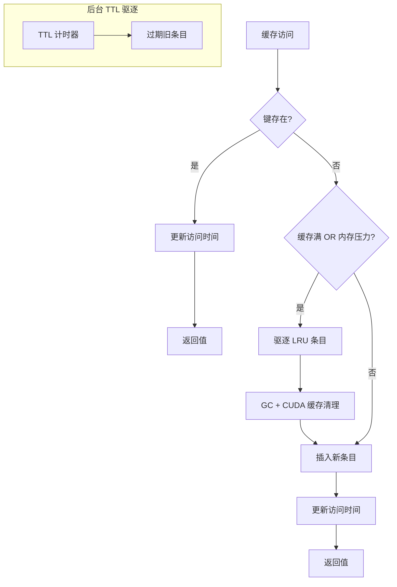
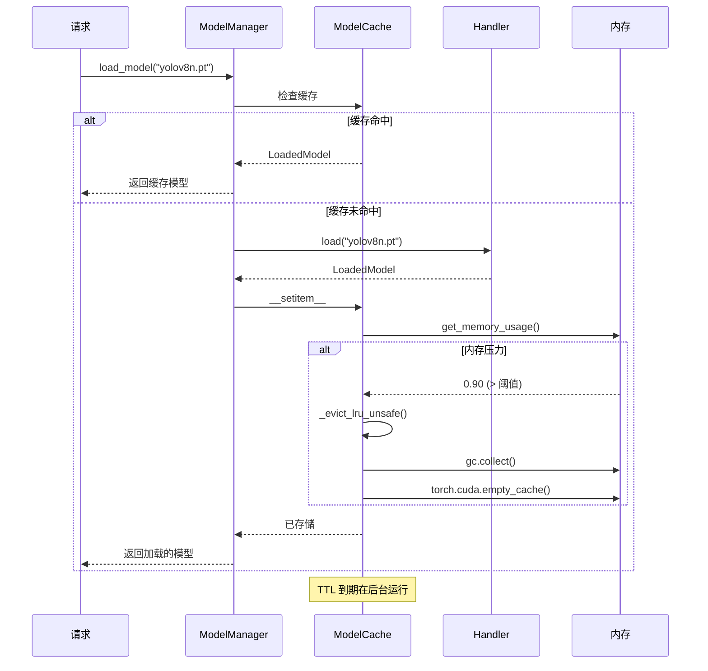

# 缓存策略：TTL + LRU 混合驱逐

YOLO-Toys 实现了复杂的缓存策略，结合 TTL 到期和内存压力下的 LRU 驱逐。本文探讨设计决策和实现细节。

## 问题陈述

模型加载代价高昂：
- **YOLO 模型**：0.1-2 秒从磁盘加载
- **HuggingFace 模型**：1-10 秒（网络下载 + 反序列化）
- **GPU 内存**：有限资源，模型可能占用数 GB

朴素缓存策略的失败：
- **无缓存**：每次请求都付出加载代价
- **无界缓存**：内存耗尽
- **仅 TTL**：不考虑内存压力
- **仅 LRU**：热门模型永远缓存，占用内存

**挑战**：如何平衡响应速度、内存使用和公平性？

## 理论基础

### TTLCache（生存时间）

TTLCache 在固定时长后自动驱逐条目，无论访问模式如何。这确保：
- 过期模型不会无限期占用内存
- 内存最终被回收
- 缓存时长的可预测上限

### LRU（最近最少使用）

LRU 在容量达到时驱逐最近最少访问的条目。这确保：
- 热门模型保持缓存
- 很少使用的模型首先被驱逐
- 缓存大小有界

### 混合方案

我们的 `ModelCache` 结合两者：



## 实现深度解析

### ModelCache 类

```python
from cachetools import TTLCache
import threading
import time
import gc

class ModelCache(TTLCache):
    """带内存监控和 LRU 驱逐的 TTL 缓存。"""

    def __init__(
        self,
        maxsize: int,
        ttl: float,
        memory_threshold: float = 0.85
    ):
        super().__init__(maxsize=maxsize, ttl=ttl)
        self._access_times: dict[str, float] = {}
        self._lock = threading.Lock()
        self._memory_threshold = memory_threshold

    def __getitem__(self, key: str) -> Any:
        """线程安全的读取，带访问时间追踪。"""
        with self._lock:
            value = super().__getitem__(key)
            self._access_times[key] = time.time()
            return value

    def __setitem__(self, key: str, value: Any) -> None:
        """线程安全的写入，带内存压力检查。"""
        with self._lock:
            # 检查驱逐条件
            if (len(self) >= self.maxsize or
                get_memory_usage() > self._memory_threshold):
                self._evict_lru_unsafe()

            super().__setitem__(key, value)
            self._access_times[key] = time.time()

    def _evict_lru_unsafe(self) -> None:
        """驱逐最近最少使用的条目（必须持有锁）。"""
        if not self._access_times:
            return

        # 找到最旧的条目
        oldest_key = min(
            self._access_times,
            key=lambda k: self._access_times[k]
        )

        logger.warning("内存压力，驱逐模型: %s", oldest_key)

        # 从缓存和追踪中移除
        self.pop(oldest_key, None)
        self._access_times.pop(oldest_key, None)

        # 激进清理
        gc.collect()
        if torch.cuda.is_available():
            torch.cuda.empty_cache()
```

### 内存监控

```python
def get_memory_usage() -> float:
    """获取当前内存使用比例（0.0-1.0）。"""
    try:
        import psutil
        return psutil.virtual_memory().percent / 100
    except ImportError:
        return 0.0  # 如果 psutil 不可用，假设无压力
```

### ModelManager 集成

```python
class ModelManager:
    def __init__(self, config: ModelManagerConfig | None = None):
        ...
        self._cache = ModelCache(
            maxsize=config.cache_maxsize,      # 默认: 10
            ttl=config.cache_ttl,              # 默认: 3600秒（1小时）
            memory_threshold=config.memory_threshold,  # 默认: 0.85
        )

    def load_model(self, model_id: str) -> LoadedModel:
        """带缓存的模型加载。"""
        # 先检查缓存
        if model_id in self._cache:
            self._access_count[model_id] += 1
            return self._cache[model_id]

        # 加载并缓存
        start_time = time.time()
        handler = self._registry.get_handler(model_id)
        loaded = handler.load(model_id)
        load_time = time.time() - start_time

        self._cache[model_id] = loaded
        self._load_times[model_id] = load_time

        logger.info(
            "模型已加载: %s (handler=%s, load_time=%.2fs)",
            model_id, type(handler).__name__, load_time
        )

        return loaded
```

## 缓存生命周期



## 配置

缓存行为通过环境变量配置：

| 变量 | 默认值 | 描述 |
|------|--------|------|
| `MODEL_CACHE_MAXSIZE` | 10 | 最大缓存模型数 |
| `MODEL_CACHE_TTL` | 3600 | 生存时间（秒） |
| `MODEL_MEMORY_THRESHOLD` | 0.85 | 内存压力阈值（0.0-1.0） |

```python
# 示例：更激进的缓存
export MODEL_CACHE_MAXSIZE=20
export MODEL_CACHE_TTL=7200  # 2 小时
export MODEL_MEMORY_THRESHOLD=0.75  # 75% 内存时驱逐
```

## 性能分析

### 缓存命中率

| 场景 | 预期命中率 | 延迟改善 |
|------|------------|----------|
| 单模型重复请求 | >95% | 10-100 倍 |
| 多模型轮换（缓存内） | ~80% | 5-50 倍 |
| 多模型轮换（超缓存） | ~50% | 2-10 倍 |
| 随机模型选择 | 低 | 最小 |

### 内存影响

```python
# 示例内存概况（近似）
MODEL_SIZES = {
    "yolov8n.pt": "6 MB",
    "yolov8s.pt": "22 MB",
    "yolov8m.pt": "52 MB",
    "yolov8l.pt": "83 MB",
    "facebook/detr-resnet-50": "160 MB",
    "google/owlvit-base-patch32": "450 MB",
}
```

使用 `cache_maxsize=10` 和混合模型：
- **最小内存**：~60 MB（10 × yolov8n）
- **最大内存**：~4.5 GB（10 × owlvit）
- **内存阈值驱逐**防止超出系统内存

## 权衡考量

### 我们获得了什么

| 收益 | 描述 |
|------|------|
| **响应速度** | 缓存模型即时返回 |
| **内存安全** | 自动驱逐防止 OOM |
| **公平性** | TTL 确保所有模型定期刷新 |
| **线程安全** | 锁防止竞争条件 |
| **可观测性** | 缓存统计通过 API 可用 |

### 我们牺牲了什么

| 代价 | 缓解措施 |
|------|----------|
| **锁开销** | 最小（Python GIL 已序列化） |
| **内存监控代价** | psutil 非常快（~微秒级） |
| **GC 暂停** | 仅在驱逐时，不频繁 |

## 监控

### 缓存统计 API

```python
@property
def cache_info(self) -> dict[str, Any]:
    return {
        "cache_size": len(self._cache),
        "cache_maxsize": self._cache.maxsize,
        "cache_ttl": self._cache.ttl,
        "cached_models": list(self._cache.keys()),
        "memory_usage": get_memory_usage(),
    }
```

### Prometheus 指标

```python
MODEL_CACHE_SIZE = Gauge("model_cache_size", "缓存模型数")
MODEL_MEMORY_USAGE = Gauge("model_memory_usage_ratio", "内存使用")
MODEL_LOAD_TIME = Gauge("model_load_duration_seconds", "加载时间", ["model_id"])
```

## 最佳实践

### 何时增加缓存大小

- 多个模型频繁访问
- 内存充足
- 加载时间显著

### 何时减少缓存大小

- 内存受限环境
- 少量模型使用
- 加载时间可接受

### 何时调整 TTL

- **短 TTL**：模型频繁更新，或内存紧张
- **长 TTL**：稳定模型，内存充足

### 何时调整内存阈值

- **低（0.7）**：保守，提前驱逐
- **高（0.95）**：激进，仅在接近 OOM 时驱逐

## 总结

TTL + LRU 混合缓存策略为 YOLO-Toys 提供：
- 通过缓存实现快速响应
- 通过压力感知驱逐实现内存安全
- 通过 TTL 到期实现公平性
- 并发请求的线程安全

核心洞见是：仅 TTL 或仅 LRU 都不足以平衡生产环境中的响应速度、内存使用和公平性——我们需要两者结合。
