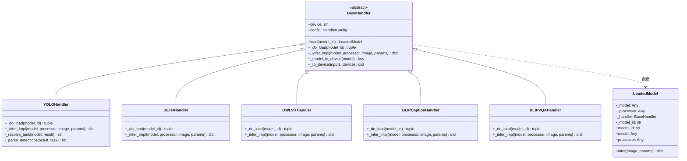
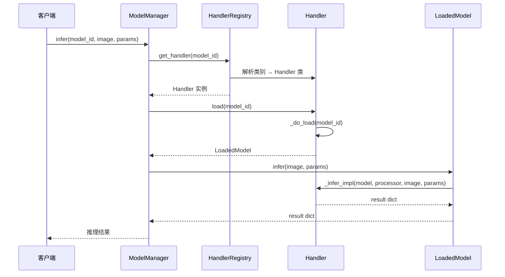

# Handler 模式：深度解析

Handler 模式是 YOLO-Toys 可扩展性的基石。本文深入探讨我们如何运用策略模式实现八种不同模型族的统一推理。

## 问题陈述

现代视觉应用需要多种模型类型：
- **检测**：YOLOv8、DETR、OWL-ViT、Grounding DINO
- **分割**：YOLOv8-seg
- **姿态估计**：YOLOv8-pose
- **多模态**：BLIP（图像描述、视觉问答）

每种模型族具有不同的：
- 加载机制（本地 `.pt` 文件 vs HuggingFace Hub）
- 预处理流程（OpenCV vs PIL、归一化差异）
- 输出格式（边界框、掩码、关键点、文本）
- 配置需求（设备放置、精度设置）

**挑战**：如何在尊重每种模型独特特性的同时提供统一接口？

## 理论基础

### 策略模式（GoF）

策略模式定义一系列算法，将每个算法封装起来，并使它们可以互换。在我们的上下文中：



### 深度模块原则

遵循 Sandi Metz 的"实用面向对象设计"，我们应用深度模块原则：

> "最好的模块是那些接口简单但实现复杂的模块。"

`LoadedModel` 类正是这一原则的体现：
- **接口**：单一的 `infer()` 方法
- **实现**：隐藏模型、处理器和 Handler 的协调逻辑

## 实现深度解析

### BaseHandler 抽象类

```python
class BaseHandler(ABC):
    """所有模型 Handler 继承自此接口。"""

    def __init__(self, config: HandlerConfig | str | None = None):
        # 支持多种初始化模式以提供灵活性
        if isinstance(config, str):
            self._device = config  # 向后兼容
        else:
            self._device = config.device

    def load(self, model_id: str) -> LoadedModel:
        """模板方法 - 加载并封装模型。"""
        model, processor = self._do_load(model_id)
        return LoadedModel(model, processor, self, model_id)

    @abstractmethod
    def _do_load(self, model_id: str) -> tuple[Any, Any | None]:
        """子类钩子：模型加载。"""
        ...

    @abstractmethod
    def _infer_impl(self, model, processor, image, params) -> dict:
        """子类钩子：推理执行。"""
        ...
```

### LoadedModel：深度模块

```python
class LoadedModel:
    """封装已加载的模型，隐藏 processor 细节。"""

    def __init__(self, model, processor, handler, model_id):
        self._model = model
        self._processor = processor
        self._handler = handler
        self._model_id = model_id

    def infer(self, image: np.ndarray, params: InferenceParams) -> dict:
        """单一入口点 - 委托给 Handler 的实现。"""
        return self._handler._infer_impl(
            self._model, self._processor, image, params
        )
```

**核心洞见**：调用者永远不需要知道处理器是否存在或如何使用它。

### YOLOHandler 示例

```python
class YOLOHandler(BaseHandler):
    """处理所有 YOLO 系列：检测、分割、姿态。"""

    def _do_load(self, model_id: str) -> tuple[Any, None]:
        # YOLO 模型不需要单独的 processor
        from ultralytics import YOLO
        return YOLO(model_id), None

    def _infer_impl(self, model, processor, image, params) -> dict:
        t0 = time.time()

        # 提取 YOLO 特定参数
        yolo_kwargs = params.for_yolo()
        yolo_kwargs["device"] = params.device or self._device

        # 运行推理
        results = model(image, **yolo_kwargs)

        # 根据任务类型解析结果
        task = self._resolve_task(model, results[0])
        detections = self._parse_detections(results[0], task)

        return make_result(image, detections=detections,
                          inference_time=(time.time() - t0) * 1000,
                          task=task)
```

### HuggingFace Handler 示例

```python
class DETRHandler(BaseHandler):
    """Facebook DETR - 需要 processor 进行前后处理。"""

    def _do_load(self, model_id: str) -> tuple[Any, Any]:
        from transformers import DetrForObjectDetection, DetrImageProcessor

        processor = DetrImageProcessor.from_pretrained(model_id)
        model = DetrForObjectDetection.from_pretrained(model_id)
        model = self._model_to_device(model)

        return model, processor

    def _infer_impl(self, model, processor, image, params) -> dict:
        pil_image = self.bgr_to_pil(image)

        # 使用 processor 预处理
        inputs = processor(images=pil_image, return_tensors="pt")
        inputs = self._to_device(inputs)

        # 运行推理
        with torch.no_grad():
            outputs = model(**inputs)

        # 使用 processor 后处理
        target_sizes = torch.as_tensor([pil_image.size[::-1]])
        results = processor.post_process_object_detection(
            outputs, target_sizes=target_sizes, threshold=params.conf
        )[0]

        # 格式化检测结果
        detections = [
            {"bbox": box.tolist(), "score": float(score),
             "label": model.config.id2label[int(label)]}
            for score, label, box in zip(
                results["scores"], results["labels"], results["boxes"]
            )
        ]

        return make_result(image, detections=detections, ...)
```

## 请求流程



## 权衡考量

### 我们获得了什么

| 收益 | 描述 |
|------|------|
| **可扩展性** | 添加新模型只需实现 `_do_load` 和 `_infer_impl` |
| **可测试性** | 每个 Handler 可独立进行单元测试 |
| **单一职责** | 每个 Handler 只了解自己的模型族 |
| **开闭原则** | 对扩展开放，对修改关闭 |

### 我们牺牲了什么

| 代价 | 缓解措施 |
|------|----------|
| **间接性** | API 与模型之间有多个层 | 清晰的命名和文档 |
| **内存开销** | 每个类别一个 Handler 实例 | Registry 中缓存 Handler |
| **学习曲线** | 开发者必须理解该模式 | 本学院文章 |

### 考虑过的替代方案：工厂模式

我们考虑过使用工厂模式，由中央工厂创建推理函数：

```python
# 被否决的方案
def create_inferencer(model_id: str) -> Callable:
    if model_id.endswith(".pt"):
        return yolo_inferencer
    elif "detr" in model_id:
        return detr_inferencer
    ...
```

**否决原因**：工厂模式创建对象但不提供行为的共享抽象。策略模式更好地封装了推理的"如何做"，而不仅仅是"做什么"。

## 扩展指南

### 添加新的模型族

1. **确定类别**：你的模型属于哪里？

```python
class ModelCategory(Enum):
    # 如需则添加新类别
    MY_NEW_TASK = auto()
```

2. **创建 Handler**：继承 `BaseHandler`

```python
class MyNewHandler(BaseHandler):
    def _do_load(self, model_id: str) -> tuple[Any, Any | None]:
        # 加载你的模型和 processor
        ...

    def _infer_impl(self, model, processor, image, params) -> dict:
        # 实现推理逻辑
        ...
```

3. **注册 Handler**：添加到类别映射

```python
_CATEGORY_HANDLER_MAP = {
    ...
    ModelCategory.MY_NEW_TASK: MyNewHandler,
}
```

4. **添加元数据**：注册你的模型

```python
MODEL_REGISTRY["my-model-id"] = {
    "category": ModelCategory.MY_NEW_TASK,
    "name": "我的模型",
    "description": "...",
    ...
}
```

5. **添加参数提取**（如需）：扩展 `InferenceParams`

```python
def for_my_new_model(self) -> dict[str, Any]:
    return {"custom_param": self.custom_param}
```

### 测试你的 Handler

```python
import pytest
from app.handlers.my_new_handler import MyNewHandler

def test_handler_loads_model():
    handler = MyNewHandler(device="cpu")
    loaded = handler.load("my-model-id")
    assert loaded.model_id == "my-model-id"
    assert loaded.model is not None

def test_handler_infers_correctly():
    handler = MyNewHandler(device="cpu")
    loaded = handler.load("my-model-id")
    dummy_image = np.zeros((640, 640, 3), dtype=np.uint8)
    result = loaded.infer(dummy_image, InferenceParams())
    assert "inference_time" in result
    assert result["task"] == "my_task"
```

## 总结

Handler 模式为 YOLO-Toys 提供：
- 多种模型族的统一接口
- 清晰的关注点分离
- 新模型的轻松扩展
- 可测试、可维护的代码

核心洞见在于策略模式结合深度模块设计，使我们能够在不牺牲灵活性的前提下管理复杂性。
