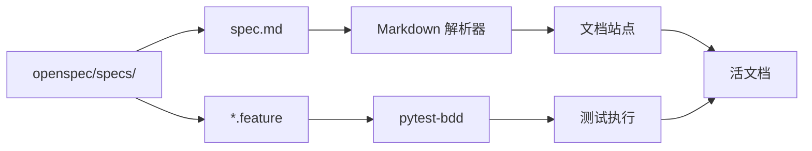
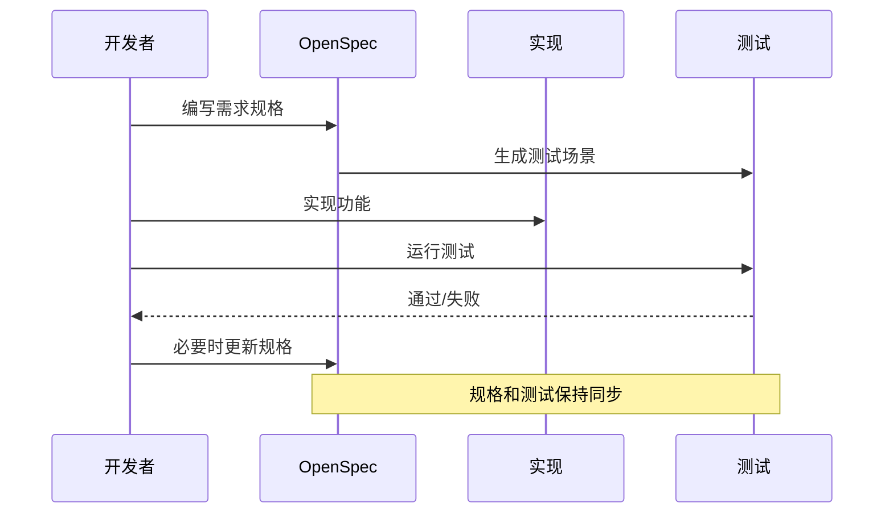

# OpenSpec 规范：行为规格说明

YOLO-Toys 使用 OpenSpec，一种基于 Gherkin 语法的规范系统来定义行为契约。本文探讨该系统如何提升文档质量和开发工作流。

## 问题陈述

传统文档存在的问题：
- **漂移**：代码变了但文档没更新
- **歧义**：自然语言不精确
- **碎片化**：规范散落在 README、Wiki、Issue 中
- **无强制**：无法验证文档与实现一致

**挑战**：如何创建与代码同步的活文档？

## 理论基础

### Gherkin 语法

Gherkin 是一种用于行为规格说明的领域特定语言，由 Cucumber 推广：

```gherkin
Feature: 功能名称
  作为 [角色]
  我想要 [功能]
  以便 [收益]

  Scenario: 场景名称
    Given [前置条件]
    When [动作]
    Then [预期结果]
```

关键特性：
- **结构化**：机器可解析格式
- **可读性**：非技术人员也能理解
- **可测试**：可作为自动化测试执行
- **活性**：与代码一起版本控制

### OpenSpec 约定

OpenSpec 将 Gherkin 适配于 API 规格：

```markdown
## 目的

定义 [领域] 契约。

---

### 需求：需求名称

系统必须 [行为约束]。

#### 场景：场景名称
Given: [前置条件]
When: [动作]
Then: [预期结果]
```

## 实现深度解析

### 目录结构

```
openspec/
├── config.yaml                 # OpenSpec 配置
├── specs/
│   ├── api/
│   │   ├── spec.md            # REST API 规格
│   │   ├── openapi.yaml       # OpenAPI 模式
│   │   └── websocket.md       # WebSocket 协议
│   ├── domain/
│   │   └── spec.md            # 领域模型规格
│   ├── testing/
│   │   ├── spec.md            # 测试策略
│   │   └── rest-api.feature   # Gherkin 测试场景
│   └── product/
│       └── spec.md            # 产品需求
└── changes/
    ├── archive/               # 已完成的变更
    └── active/                # 进行中的工作
```

### API 规格示例

```markdown
## 目的

定义 YOLO-Toys 推理平台的 REST API 契约。

---

### 需求：健康检查端点

系统必须提供返回服务状态的 `/health` 端点。

#### 场景：服务健康
Given: FastAPI 应用正在运行
When: 向 `/health` 发送 GET 请求
Then: 响应状态码 200，包含 `{ "status": "ok", "version": "...", "device": "..." }`

---

### 需求：推理端点

系统必须提供用于检测、分割和姿态任务的 `/infer` 端点。

#### 场景：成功的目标检测
Given: 有效的图像文件和检测模型 ID
When: 向 `/infer` 发送带图像的 POST 请求
Then: 响应包含 `width`、`height`、`task: "detect"`、`detections` 数组

#### 场景：无效图像格式
Given: 无效文件（非图像）
When: 向 `/infer` 发送 POST 请求
Then: 响应状态码 400，包含错误详情
```

### Gherkin 测试场景

```gherkin
Feature: REST API 推理
  作为用户
  我想要通过 REST API 对图像进行推理
  以便检测图像中的物体

  Background:
    Given 服务器在端口 8000 上运行
    And 默认模型是 yolov8n.pt

  Scenario: 成功的检测推理
    Given 我有一个有效的图像文件 "test.jpg"
    When 我向 "/infer" 发送 POST 请求：
      | field   | value      |
      | file    | test.jpg   |
      | model   | yolov8n.pt |
      | conf    | 0.25       |
    Then 响应状态码应为 200
    And 响应应包含 "width"
    And 响应应包含 "height"
    And 响应应包含 "task" 值为 "detect"
    And 响应应包含 "detections" 为数组

  Scenario Outline: 开放词汇检测
    Given 我有一个有效的图像文件 "test.jpg"
    When 我向 "/infer" 发送 POST 请求：
      | field        | value          |
      | file         | test.jpg       |
      | model        | <model>        |
      | text_queries | "猫, 狗"       |
    Then 响应状态码应为 200

    Examples:
      | model                          |
      | google/owlvit-base-patch32     |
      | IDEA-Research/grounding-dino-tiny |
```

## 规格即文档

### 双重用途

OpenSpec 文件同时作为：
1. **文档**：人类阅读 markdown 规格
2. **测试**：工具执行 Gherkin 场景

### 文档生成



## 工作流集成

### 开发工作流



### 变更管理

OpenSpec 包含变更管理系统：

```
openspec/changes/
├── active/
│   └── 2026-05-15-add-sam-support/
│       ├── proposal.md
│       ├── design.md
│       └── tasks.md
└── archive/
    └── 2026-04-24-normalize-project/
        ├── proposal.md
        └── tasks.md
```

每个变更遵循结构化流程：
1. **提议**：创建带理由的提案
2. **设计**：记录技术方案
3. **任务**：分解实现步骤
4. **归档**：完成后移至归档

## 权衡考量

### 我们获得了什么

| 收益 | 描述 |
|------|------|
| **活文档** | 规格与代码一起版本控制 |
| **可测试性** | Gherkin 场景可作为测试执行 |
| **精确性** | 结构化格式减少歧义 |
| **可追溯性** | 需求与实现相关联 |
| **可审查性** | 变更在 PR 中可见 |

### 我们牺牲了什么

| 代价 | 缓解措施 |
|------|----------|
| **学习曲线** | Gherkin 语法需要练习 | 清晰的示例和模板 |
| **维护开销** | 规格需随代码更新 | 作为完成的定义的一部分 |
| **工具复杂性** | 需要 pytest-bdd、解析器 | 值得为收益付出 |

### 考虑过的替代方案：传统文档

我们考虑过仅使用 markdown 文档：

```markdown
# API 参考

## POST /infer

接受图像文件并返回检测结果。

参数：
- `model`：模型 ID（默认：yolov8n.pt）
- `conf`：置信度阈值
...
```

**否决原因**：
- 无结构强制
- 文档容易与实现漂移
- 无自动验证

## 最佳实践

### 编写好的场景

1. **关注行为而非实现**：
   ```gherkin
   # 好：系统做什么
   Then 响应包含 "detections" 为数组

   # 坏：系统如何做
   Then YOLOHandler 被调用并传入图像
   ```

2. **使用场景大纲处理变体**：
   ```gherkin
   Scenario Outline: 使用不同模型检测
     When 我发送请求使用模型 "<model>"
     Then 响应状态码应为 200

     Examples:
       | model        |
       | yolov8n.pt   |
       | yolov8s.pt   |
       | yolov8m.pt   |
   ```

3. **保持场景独立**：
   - 每个场景应可独立运行
   - 场景之间无依赖

### 组织规格

1. **每个领域一个规格**：API、Domain、Testing 等
2. **按功能分组**：Health、Inference、Models
3. **使用一致的术语**：与代码库命名匹配

## 与测试集成

### pytest-bdd 集成

```python
# test_api.py
from pytest_bdd import scenario, given, when, then

@scenario("rest-api.feature", "成功的检测推理")
def test_detection_inference():
    pass

@given("我有一个有效的图像文件")
def valid_image():
    return load_test_image("test.jpg")

@when("我向 /infer 发送 POST 请求")
def send_inference_request(valid_image):
    return client.post("/infer", files={"file": valid_image})

@then("响应状态码应为 200")
def check_status(send_inference_request):
    assert send_inference_request.status_code == 200
```

## 总结

OpenSpec 系统为 YOLO-Toys 提供：
- 随代码演进的活文档
- 用于验证的可执行规格
- 结构化的变更管理
- 从需求到实现的可追溯性

核心洞见是：文档不应与代码分离——它应该是一等公民，与实现接受同等严格的对待。
