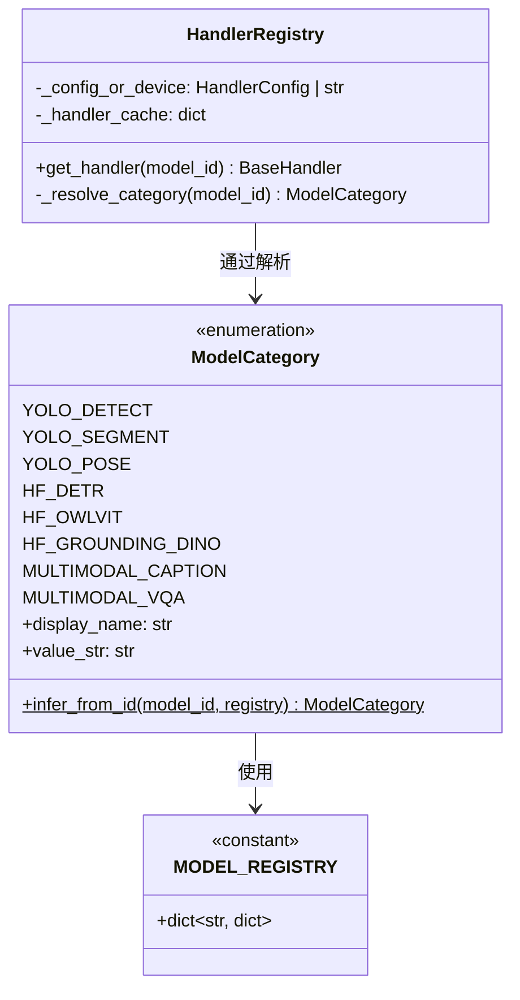
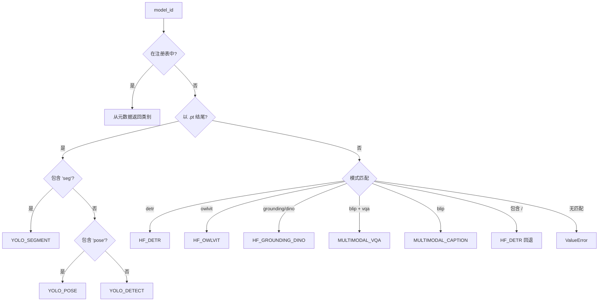

# Registry 模式：集中式元数据管理

Registry 模式提供模型元数据的单一事实来源，实现自动模型发现、类别推断和一致的 API 响应。

## 问题陈述

支持多种模型族时，我们需要回答：
- 有哪些可用模型？
- 模型属于哪个类别？
- 应该用哪个 Handler 处理这个模型？
- 应该展示什么元数据（名称、描述、速度、精度）？

没有注册表，这些逻辑会散落在：
- 路由 Handler（用于 `/models` 端点）
- 模型管理器（用于 Handler 解析）
- 配置文件
- 前端代码

**挑战**：如何在保持可扩展性的同时集中这些知识？

## 理论基础

### Registry 模式

Registry 模式为对象提供查找服务。它是 Repository 模式的特化形式，专注于读密集、查找密集的场景。



### 深度模块：ModelCategory

`ModelCategory` 枚举体现了深度模块设计：
- **接口**：枚举值 + `infer_from_id()` 类方法
- **实现**：封装所有推断规则和回退逻辑

## 实现深度解析

### ModelCategory 枚举

```python
class ModelCategory(Enum):
    """模型类别枚举，具有推断能力。"""

    YOLO_DETECT = auto()
    YOLO_SEGMENT = auto()
    YOLO_POSE = auto()
    HF_DETR = auto()
    HF_OWLVIT = auto()
    HF_GROUNDING_DINO = auto()
    MULTIMODAL_CAPTION = auto()
    MULTIMODAL_VQA = auto()

    @classmethod
    def infer_from_id(cls, model_id: str, registry: dict | None = None) -> "ModelCategory":
        """
        从模型 ID 推断类别。

        优先级：
        1. 显式注册表查找
        2. 文件扩展名推断（.pt → YOLO）
        3. 字符串模式匹配（detr, owlvit 等）
        4. 回退启发式
        """
        # 优先级 1：注册表查找
        if registry and model_id in registry:
            cat = registry[model_id].get("category")
            if isinstance(cat, cls):
                return cat

        # 优先级 2：YOLO .pt 文件
        if model_id.endswith(".pt"):
            lower = model_id.lower()
            if "seg" in lower:
                return cls.YOLO_SEGMENT
            if "pose" in lower:
                return cls.YOLO_POSE
            return cls.YOLO_DETECT

        # 优先级 3：HuggingFace 模式匹配
        lower = model_id.lower()
        if "detr" in lower:
            return cls.HF_DETR
        if "owlvit" in lower:
            return cls.HF_OWLVIT
        if "grounding" in lower or "dino" in lower:
            return cls.HF_GROUNDING_DINO
        if "blip" in lower and "vqa" in lower:
            return cls.MULTIMODAL_VQA
        if "blip" in lower:
            return cls.MULTIMODAL_CAPTION

        # 优先级 4：HuggingFace org/model 格式回退
        if "/" in model_id:
            return cls.HF_DETR

        raise ValueError(f"未知模型: {model_id}")
```

### MODEL_REGISTRY 常量

```python
MODEL_REGISTRY: dict[str, dict[str, Any]] = {
    # YOLO 检测
    "yolov8n.pt": {
        "category": ModelCategory.YOLO_DETECT,
        "name": "YOLOv8 Nano",
        "description": "超轻量检测模型，适合实时场景，速度最快",
        "speed": "极快",
        "accuracy": "中等",
    },
    # ... 更多模型

    # 开放词汇检测
    "google/owlvit-base-patch32": {
        "category": ModelCategory.HF_OWLVIT,
        "name": "OWL-ViT Base",
        "description": "开放词汇检测，可检测任意文本描述的物体",
        "speed": "中等",
        "accuracy": "高",
    },

    # 多模态
    "Salesforce/blip-image-captioning-base": {
        "category": ModelCategory.MULTIMODAL_CAPTION,
        "name": "BLIP Caption Base",
        "description": "图像描述生成模型",
        "speed": "中等",
        "accuracy": "高",
    },
}
```

### HandlerRegistry 类

```python
# 类别 → Handler 类映射
_CATEGORY_HANDLER_MAP = {
    ModelCategory.YOLO_DETECT: YOLOHandler,
    ModelCategory.YOLO_SEGMENT: YOLOHandler,
    ModelCategory.YOLO_POSE: YOLOHandler,
    ModelCategory.HF_DETR: DETRHandler,
    ModelCategory.HF_OWLVIT: OWLViTHandler,
    ModelCategory.HF_GROUNDING_DINO: GroundingDINOHandler,
    ModelCategory.MULTIMODAL_CAPTION: BLIPCaptionHandler,
    ModelCategory.MULTIMODAL_VQA: BLIPVQAHandler,
}

class HandlerRegistry:
    """Handler 注册表 - 根据模型 ID 解析 Handler 实例。"""

    def __init__(self, config_or_device: "HandlerConfig | str"):
        self._config_or_device = config_or_device
        self._handler_cache: dict[str, BaseHandler] = {}

    def get_handler(self, model_id: str) -> BaseHandler:
        """获取模型对应的 Handler 实例（带缓存）。"""
        category = self._resolve_category(model_id)
        handler_cls = _CATEGORY_HANDLER_MAP.get(category)

        if handler_cls is None:
            raise ValueError(f"未知模型类别: {model_id}")

        cls_name = handler_cls.__name__
        if cls_name not in self._handler_cache:
            self._handler_cache[cls_name] = handler_cls(self._config_or_device)

        return self._handler_cache[cls_name]

    def _resolve_category(self, model_id: str) -> ModelCategory:
        """委托给 ModelCategory.infer_from_id。"""
        return ModelCategory.infer_from_id(model_id, MODEL_REGISTRY)
```

## 类别解析流程



## 权衡考量

### 我们获得了什么

| 收益 | 描述 |
|------|------|
| **单一事实来源** | 所有模型元数据在一处 |
| **自动发现** | API 端点可动态查询注册表 |
| **灵活解析** | 对未知模型有多种推断策略 |
| **类型安全** | 枚举防止无效类别 |
| **向后兼容** | `value_str` 属性支持遗留字符串代码 |

### 我们牺牲了什么

| 代价 | 缓解措施 |
|------|----------|
| **集中化变更** | 添加模型需要修改代码 | 简单字典结构，易于扩展 |
| **运行时发现限制** | 不修改代码无法添加模型 | 支持临时的 `.pt` 文件 |
| **枚举僵化** | 添加类别需要修改代码 | 对稳定的模型族可接受 |

## 扩展指南

### 添加新模型到现有类别

```python
# 在 models_metadata.py 中
MODEL_REGISTRY["yolov8x.pt"] = {
    "category": ModelCategory.YOLO_DETECT,
    "name": "YOLOv8 XLarge",
    "description": "超大规模检测模型，最高精度",
    "speed": "慢",
    "accuracy": "最高",
}
```

### 添加新类别

1. 添加枚举值：

```python
class ModelCategory(Enum):
    ...
    MY_NEW_CATEGORY = auto()
```

2. 更新 display_name 和 value_str 映射

3. 创建 Handler：

```python
class MyNewHandler(BaseHandler):
    ...
```

4. 添加到类别-Handler 映射：

```python
_CATEGORY_HANDLER_MAP[ModelCategory.MY_NEW_CATEGORY] = MyNewHandler
```

5. 在 `infer_from_id()` 中添加推断逻辑

### 支持动态模型发现

对于真正的动态模型（如用户上传的 `.pt` 文件），注册表自动处理：

```python
# 任何 .pt 文件都被推断为 YOLO
model_id = "my-custom-model.pt"
category = ModelCategory.infer_from_id(model_id, MODEL_REGISTRY)
# → ModelCategory.YOLO_DETECT（或 YOLO_SEGMENT/POSE 如果名称包含关键字）
```

## 总结

Registry 模式为 YOLO-Toys 提供：
- 集中、可维护的模型元数据
- 具有多种回退策略的灵活类别推断
- 模型发现与模型使用的清晰分离
- API 响应的单一事实来源

结合 Handler 模式，创建了清晰的架构：
- **Registry** 处理"是什么"（模型存在、元数据）
- **Handler** 处理"怎么做"（模型加载、推理）
