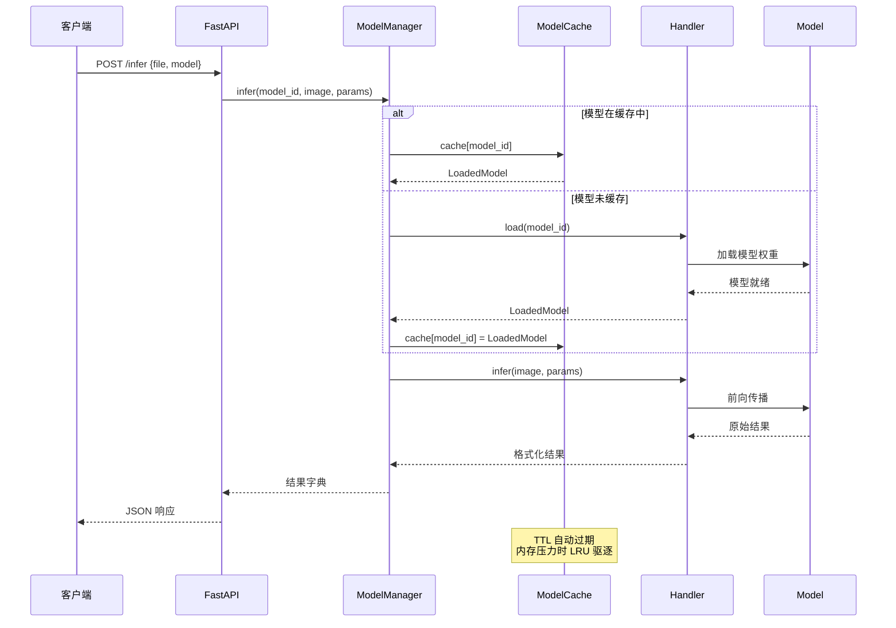
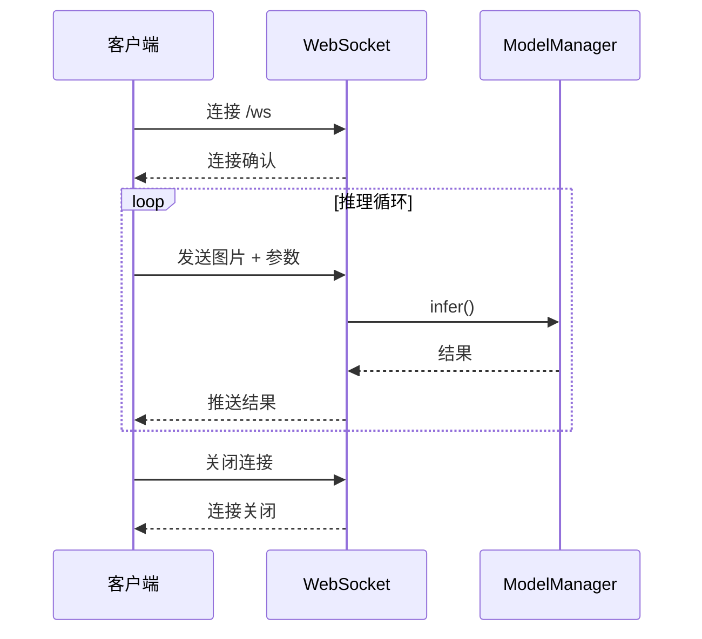

# 请求流程

本文档详细描述 YOLO-Toys 的请求处理流程。

## 整体流程



## REST API 流程

### 1. 请求接收

```python
@app.post("/infer")
async def infer(
    file: UploadFile = File(...),
    model: str = Form(...),
    confidence: float = Form(0.25),
):
    # 读取图片
    image = await file.read()

    # 调用 ModelManager
    result = await model_manager.infer(model, image, params)

    return result
```

### 2. 模型加载

1. 检查缓存是否存在模型
2. 如不存在，从 HandlerRegistry 获取 Handler
3. 调用 Handler.load() 加载模型
4. 将 LoadedModel 存入缓存

### 3. 推理执行

1. 从缓存获取 LoadedModel
2. 调用 LoadedModel.infer()
3. 处理结果格式化
4. 返回 JSON 响应

## WebSocket 流程



## 性能关键路径

| 阶段 | 耗时 | 优化点 |
|------|------|--------|
| 图片解码 | ~5ms | 使用 libjpeg-turbo |
| 模型推理 | ~30ms | FP16、批处理 |
| 结果序列化 | ~2ms | 使用 orjson |

## 错误处理流程

所有错误在 API 层统一捕获并转换为标准错误响应格式。
