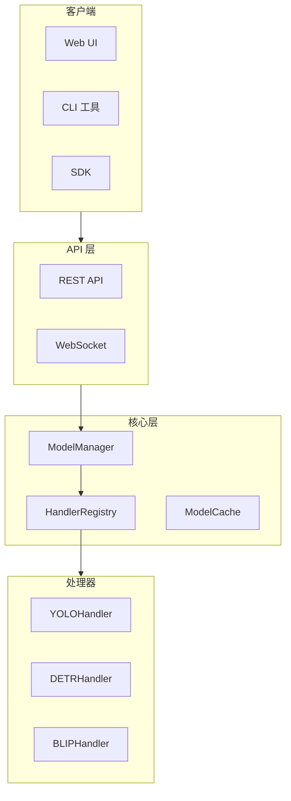

## 快速开始

```bash
docker run -p 8000:8000 ghcr.io/lessup/yolo-toys:latest
```

然后访问 [http://localhost:8000](http://localhost:8000) 查看 API 界面。

## 架构概览


```mermaid
graph TB
    subgraph Client["客户端"]
        WEB[Web UI]
        CLI[CLI 工具]
        SDK[SDK]
    end

    subgraph API["API 层"]
        REST[REST API]
        WS[WebSocket]
    end

    subgraph Core["核心层"]
        MM[ModelManager]
        REG[HandlerRegistry]
        CACHE[ModelCache]
    end

    subgraph Handlers["处理器"]
        YOLO[YOLOHandler]
        DETR[DETRHandler]
        BLIP[BLIPHandler]
    end

    Client --> API
    API --> MM
    MM --> REG --> Handlers
```
