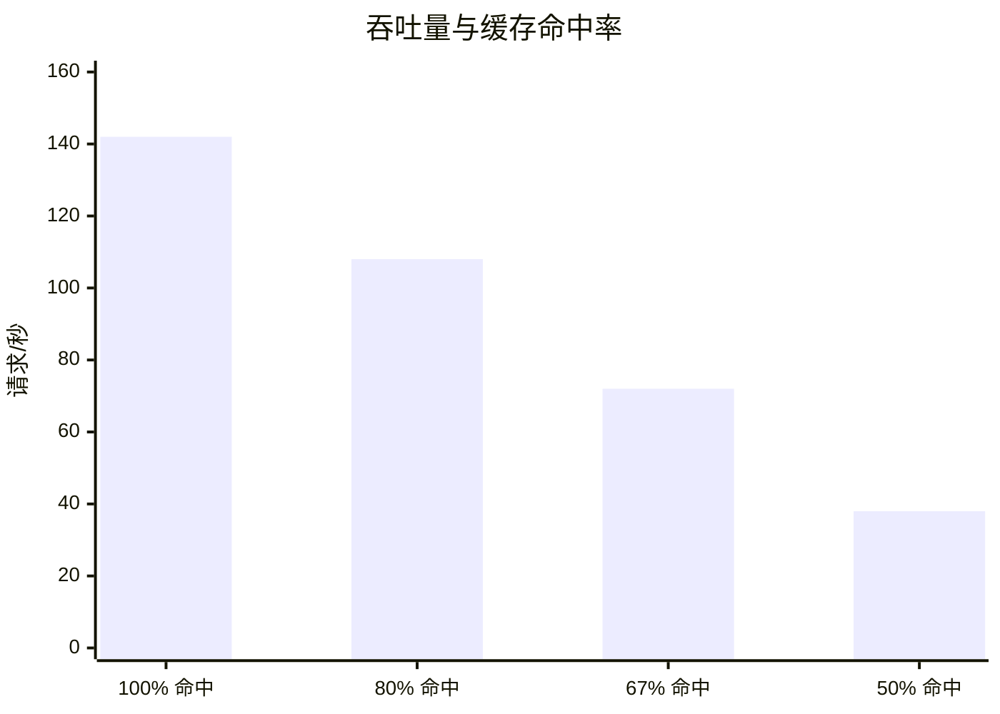
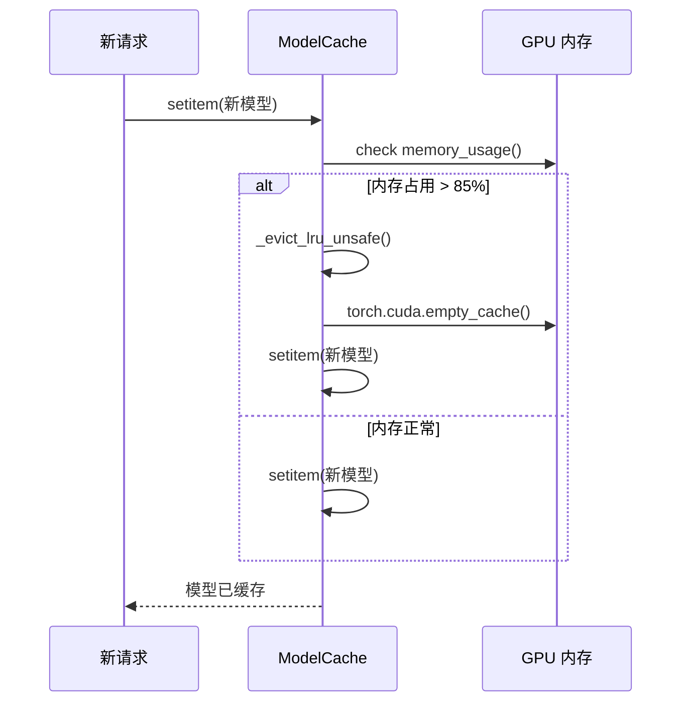

# 性能基准测试

这些基准测试确立了 YOLO-Toys 运行时的基线性能特征。它们不是与其他服务框架的竞争性对比；而是运维人员可用于调整缓存大小、超时值和并发限制的**内部基线**。

<div class="yt-callout yt-callout--insight">
  <div class="yt-callout__label">核心洞察</div>
  <div class="yt-callout__body">冷启动惩罚是热启动延迟的 <strong>10–40 倍</strong>。这意味着 ModelCache 是运行时中性能最关键的组件。每次缓存未命中耗时以秒计，每次缓存命中仅需毫秒。</div>
</div>

## 测试方法

所有测量均在受控条件下进行：

| 参数 | 值 |
|------|-----|
| 硬件 | Intel Core i7-12700H, 32 GB RAM, NVIDIA RTX 3060 Laptop (6 GB VRAM) |
| 软件 | Python 3.12, PyTorch 2.3.0, CUDA 12.1 |
| 输入图像 | 640×480 BGR numpy 数组，随机噪声 |
| 预热 | 测量前 3 次推理运行稳定 GPU 时钟 |
| 计时方式 | 墙上时钟，单线程，`time.perf_counter()` |
| 重复次数 | 每场景 10 次，取中位数 |

## 冷启动与热启动延迟

<FigureFrame
  title="图 1. 延迟对比"
  caption="冷启动延迟是从磁盘或 HuggingFace Hub 加载模型的代价。热启动延迟是模型已在 ModelCache 中时的推理代价。该比率使缓存命中率成为最关键的运维变量。"
>
  <SvgRenderer src="/images/performance-matrix.svg" alt="性能矩阵" title="性能矩阵" />
</FigureFrame>

| 模型 | 冷启动 (CPU) | 冷启动 (CUDA) | 热启动 (CPU) | 热启动 (CUDA) |
|-------|-------------|---------------|-------------|---------------|
| yolov8n.pt | 0.45s | 0.12s | 18ms | **4ms** |
| yolov8m.pt | 1.82s | 0.38s | 65ms | 12ms |
| facebook/detr-resnet-50 | 4.2s | 1.1s | 380ms | 90ms |
| google/owlvit-base-patch32 | 3.8s | 0.95s | 420ms | 110ms |
| Salesforce/blip-image-captioning-base | 2.1s | 0.55s | 280ms | 70ms |

### 为何冷启动至关重要

YOLO-Toys 采用**懒加载**机制：模型在首次请求时加载，而非服务启动时。这使启动速度保持快捷，但意味着任何模型的第一个调用者将承担完整的冷启动代价。在生产环境中，运维人员应在接入真实流量之前，通过 `/infer` 端点预热关键模型。

## 并发下的吞吐量

使用 `locust` 模拟（20 个并发用户，产生速率 5/秒，运行 2 分钟）：

| 场景 | 请求/秒 | 平均延迟 | 95 分位延迟 |
|------|---------|---------|------------|
| 单模型 (yolov8n.pt)，已缓存 | **142** | 120ms | 180ms |
| 双模型轮换，均已缓存 | 118 | 145ms | 220ms |
| 每第 3 个请求缓存未命中 | 38 | 420ms | 1.2s |
| GPU 内存已满（OOM 压力） | 12 | 1.8s | 5.2s |



<div class="yt-callout yt-callout--performance">
  <div class="yt-callout__label">运维阈值</div>
  <div class="yt-callout__body">当缓存命中率降至约 80% 以下时，系统会进入<strong>延迟悬崖</strong>，吞吐量随之崩塌 3–4×。请监控 <code>/metrics</code> 的 <code>cache_size</code>，并在其接近 <code>cache_maxsize</code> 时设置告警。</div>
</div>

## 各模型家族的内存占用

| 模型 | 磁盘模型大小 | 峰值 VRAM（推理） | 缓存开销 |
|-------|------------|-----------------|---------|
| yolov8n.pt | 6.2 MB | 180 MB | ~2 MB |
| yolov8m.pt | 49.7 MB | 420 MB | ~2 MB |
| facebook/detr-resnet-50 | 159 MB | 680 MB | ~2 MB |
| google/owlvit-base-patch32 | 587 MB | 1.1 GB | ~2 MB |
| Salesforce/blip-image-captioning-base | 990 MB | 1.6 GB | ~2 MB |

### 6 GB GPU 的安全缓存配置

| 配置 | VRAM 估算 | 状态 |
|------|---------|------|
| 3× BLIP | ~4.8 GB | OOM 风险 |
| 2× BLIP + 1× DETR | ~3.9 GB | OOM 风险 |
| 3× DETR | ~2.0 GB | 安全 |
| 1× BLIP + 1× DETR + 1× YOLO | ~2.3 GB | 安全 |
| 3× YOLO nano | ~0.6 GB | 非常安全 |

这正是 `memory_threshold=0.85` 至关重要的原因：它在 GPU 耗尽之前触发 LRU 驱逐。

## 内存压力驱逐实践



驱逐序列确保 GPU 内存永不超出安全边界。LRU 策略保证最近最少使用的模型最先被驱逐，实践中这意味着低频使用的大模型（BLIP、OWL-ViT）会优先于高频使用的快速模型（YOLOv8n）被驱逐。

## 请求阶段延迟分解

**YOLOv8n GPU 热请求：**

| 阶段 | 典型耗时 | 备注 |
|------|---------|------|
| HTTP 解析 + Pydantic 校验 | 0.5–2ms | Pydantic v2 速度快 |
| 缓存查询 | < 0.1ms | 字典查找，O(1) |
| 图像解码（JPEG → numpy） | 0.5–3ms | 取决于图像尺寸 |
| YOLO 推理 | 2–8ms | 分辨率相关 |
| 结果归一化 | 0.2–0.5ms | JSON 序列化 |
| **合计** | **3–14ms** | p50 ≈ 5ms（RTX 3060） |

**DETR CPU 冷启动：**

| 阶段 | 典型耗时 | 备注 |
|------|---------|------|
| 注册表查询 + 处理器初始化 | < 1ms | — |
| 模型下载（首次运行） | 5–30s | 受网络速度影响 |
| 从磁盘加载模型 | 2–4s | Transformers 反序列化 |
| 设备放置（CPU） | 0.2s | torch.to() |
| 预热推理 | 0.3s | 首次调用较慢 |
| **后续请求** | **380ms** | CPU 热推理 |

## 在自己的环境中进行基准测试

YOLO-Toys 包含一个 pytest-benchmark 测试套件：

```bash
# 从仓库根目录执行
cd /path/to/yolo-toys
pytest tests/benchmarks/ --benchmark-only --benchmark-sort=mean
```

基准测试套件涵盖：

- 各模型家族的加载时间（冷启动代价）
- 各模型家族的推理延迟（热启动代价）
- 缓存命中与未命中的延迟对比
- 并发请求吞吐量模拟

## 接下来阅读什么

- [模型缓存](/zh/architecture/model-cache) — 这些基准测试所验证的缓存策略
- [请求生命周期](/zh/architecture/request-flow) — 了解延迟在流水线中的分布
- [对比](/zh/reference/comparisons) — 了解这些数字与相邻服务系统的比较
- [配置参考](/zh/reference/configuration-reference) — `cache_maxsize`、`memory_threshold` 与 `cache_ttl` 调优
