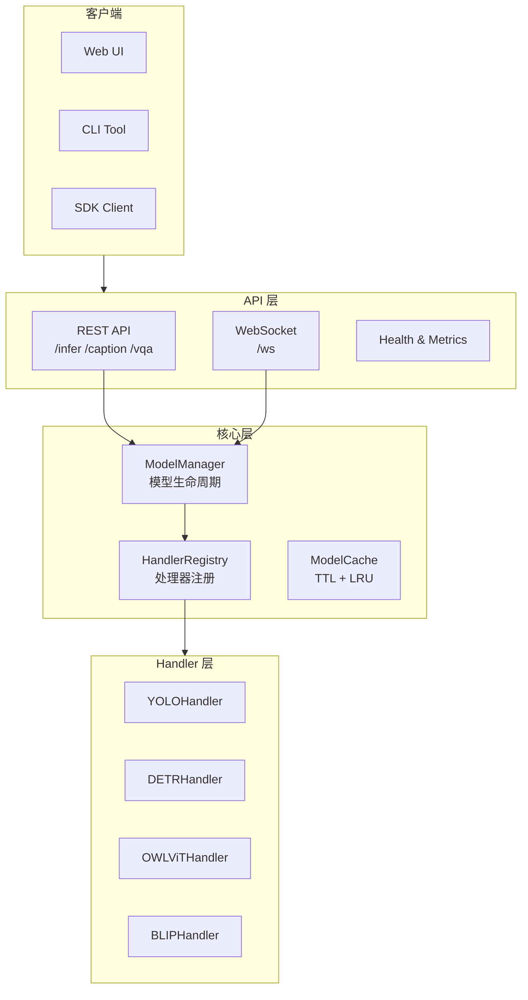
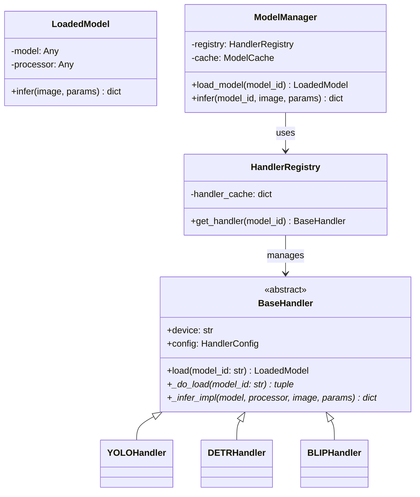
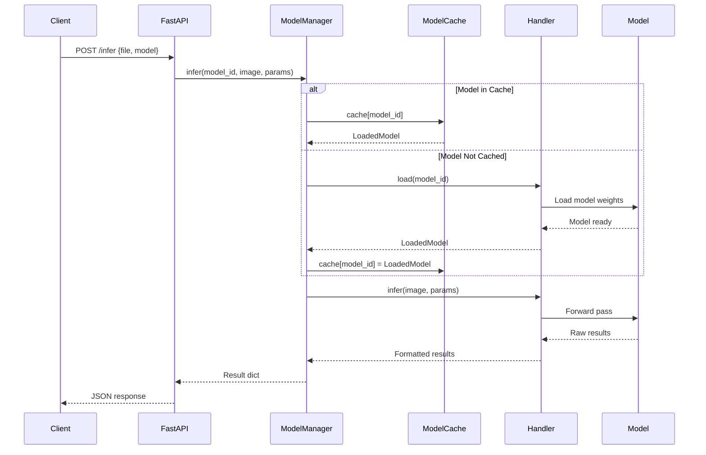

# YOLO-Toys GitHub Pages 重构方案

> 生成时间: 2026-05-15
> 项目: YOLO-Toys 多模型视觉推理平台
> 目标: 打造行业标杆级技术白皮书站点

---

## 一、背景与目标

### 1.1 为什么需要重构

当前 YOLO-Toys Git Pages 存在以下核心问题：

| 问题类型 | 具体表现 | 影响 |
|---------|---------|------|
| **内容冗余** | 旧版 `docs/*.md` 与新版 `docs/en/`, `docs/zh/` 并存 | 维护混乱 |
| **Jekyll 遗留** | `_includes/`, front matter 等无用文件 | 技术债务 |
| **内容精简过度** | 新版比旧版减少 60-85% | 信息缺失 |
| **零视觉资源** | 无图片/SVG/Mermaid 图表 | 缺乏吸引力 |
| **深浅色适配问题** | SVG/图表在深色模式下显示不佳 | 用户体验差 |
| **配置缺陷** | `ignoreDeadLinks: true` 隐藏问题 | 质量风险 |

### 1.2 重构目标

**核心定位**: 高级技术白皮书 / 架构展示站 / 项目导读与学院

**受众**: 严苛的面试官、GitHub 社区高级开发者

**效果**: 在同类项目中具备"降维打击"优势，亮点突出，极具专业度、学术感和极客美学

---

## 二、技术方案总览

### 2.1 技术栈（已对齐 kimi-cli）

| 组件 | 当前版本 | 目标版本 | 状态 |
|------|---------|---------|------|
| VitePress | 1.6.4 | 1.6.4 | ✅ 已对齐 |
| Mermaid 插件 | 已有 | 升级配置 | 🔧 需优化 |
| LLM.txt 插件 | 已有 | 已有 | ✅ 已对齐 |
| CHANGELOG 同步 | 无 | 🆕 新增 | ➕ 需添加 |
| PR 验证构建 | 无 | 🆕 新增 | ➕ 需添加 |

### 2.2 实施策略

采用**激进策略**：丢弃历史包袱，一切以长期收益和技术先进性为第一指导原则。

---

## 三、文件变更清单

### 3.1 删除文件（~42 个）

```bash
# Jekyll 遗留
docs/_includes/               # 整个目录

# 旧版根目录文档（已被 en/ zh/ 替代）
docs/README.md
docs/README.zh-CN.md
docs/index.md
docs/api/                     # 整个目录
docs/architecture/            # 整个目录
docs/deployment/              # 整个目录
docs/getting-started/         # 整个目录
docs/guides/                  # 整个目录
docs/reference/               # 整个目录
```

### 3.2 新建文件

```
docs/
├── .vitepress/
│   ├── config.ts              # 重构配置
│   ├── theme/
│   │   ├── index.ts           # 主题入口
│   │   ├── style.css          # 设计系统样式
│   │   └── components/        # Vue 组件目录
│   │       ├── HomeHero.vue   # 首页 Hero 组件
│   │       └── FeatureCard.vue
│   └── cache/                 # 构建缓存（.gitignore）
│
├── public/                    # 静态资源
│   └── images/
│       ├── logo.svg
│       └── architecture/
│
├── en/
│   ├── index.md               # 首页
│   ├── academy/               # 🆕 学院模块
│   │   ├── index.md
│   │   ├── handler-pattern.md
│   │   ├── registry-pattern.md
│   │   ├── caching-strategy.md
│   │   └── openspec-system.md
│   ├── guides/
│   │   ├── custom-handler.md  # 🆕 深度指南
│   │   └── performance-tuning.md  # 🆕 性能调优
│   ├── api/
│   │   └── error-codes.md     # 🆕 错误码参考
│   ├── architecture/
│   │   ├── request-flow.md    # 🆕 请求流程
│   │   └── adr/               # 🆕 架构决策记录
│   │       ├── 001-handler-pattern.md
│   │       ├── 002-registry-pattern.md
│   │       └── 003-caching-strategy.md
│   ├── deployment/
│   │   ├── kubernetes.md      # 🆕 K8s 部署
│   │   └── monitoring.md      # 🆕 监控告警
│   ├── reference/
│   │   ├── benchmarks.md      # 🆕 性能基准
│   │   ├── comparisons.md     # 🆕 竞品对比
│   │   └── changelog.md       # 🆕 CHANGELOG 同步
│   ├── community/             # 🆕 社区模块
│   │   ├── index.md
│   │   └── contributing.md
│   └── citations.md           # 🆕 学术引用
│
├── zh/                        # 镜像结构
│   ├── academy/
│   ├── architecture/adr/
│   ├── deployment/
│   ├── reference/
│   ├── community/
│   └── citations.md
│
└── scripts/                   # 🆕 自动化脚本
    └── sync-changelog.mjs     # CHANGELOG 同步
```

### 3.3 修改文件

| 文件 | 修改内容 |
|------|----------|
| `docs/.vitepress/config.ts` | 重构配置，移除 `ignoreDeadLinks`，添加 sitemap/lastUpdated |
| `docs/.vitepress/theme/style.css` | 设计系统升级，深浅色模式完善 |
| `docs/.vitepress/theme/index.ts` | 扩展主题，注册 Vue 组件 |
| `docs/package.json` | 添加 sync-changelog 脚本 |
| `.github/workflows/docs-pages.yml` | 添加 PR 验证、CHANGELOG 同步 |
| `docs/en/index.md` | 使用 Vue 组件重构首页 |
| `docs/zh/index.md` | 使用 Vue 组件重构首页 |

---

## 四、设计系统方案

### 4.1 CSS 变量体系（对齐 kimi-cli + YOLO 品牌色）

```css
/* 设计令牌 */
:root {
  /* 品牌色 - YOLO Orange */
  --vp-c-brand-1: #FF6B35;
  --vp-c-brand-2: #FF8C5A;
  --vp-c-brand-3: #FFAB76;
  --vp-c-brand-soft: rgba(255, 107, 53, 0.14);

  /* GitHub 风格背景 */
  --vp-c-bg: #ffffff;
  --vp-c-bg-alt: #f6f8fa;
  --vp-c-bg-elv: #ffffff;
  --vp-c-bg-soft: #f6f8fa;

  /* 文字层次 */
  --vp-c-text-1: #24292f;
  --vp-c-text-2: #57606a;
  --vp-c-text-3: #8b949e;

  /* 边框 */
  --vp-c-border: #d0d7de;
  --vp-c-divider: #d0d7de;

  /* Hero 简化 */
  --vp-home-hero-name-color: #FF6B35;
  --vp-home-hero-name-background: transparent;
  --vp-home-hero-image-background-image: none;

  /* 自定义间距 */
  --spacing-xs: 8px;
  --spacing-sm: 12px;
  --spacing-md: 16px;
  --spacing-lg: 24px;
  --spacing-xl: 32px;
  --spacing-2xl: 40px;

  /* 圆角 */
  --radius-sm: 6px;
  --radius-md: 8px;
  --radius-lg: 12px;
  --radius-xl: 16px;

  /* 过渡 */
  --transition-fast: 0.15s ease;
  --transition-normal: 0.2s ease;
}

/* 深色模式 */
.dark {
  --vp-c-brand-1: #FF8C5A;
  --vp-c-brand-2: #FF6B35;
  --vp-c-brand-soft: rgba(255, 107, 53, 0.16);

  --vp-c-bg: #0d1117;
  --vp-c-bg-alt: #161b22;
  --vp-c-bg-elv: #21262d;
  --vp-c-bg-soft: #21262d;

  --vp-c-text-1: #c9d1d9;
  --vp-c-text-2: #8b949e;
  --vp-c-text-3: #6e7681;

  --vp-c-border: #30363d;
  --vp-c-divider: #30363d;
}
```

### 4.2 Mermaid 深色模式修复

```css
/* 深色模式 Mermaid 适配 */
.dark .mermaid {
  background: transparent;
}

.dark .mermaid .node rect,
.dark .mermaid .node circle,
.dark .mermaid .node ellipse,
.dark .mermaid .node polygon,
.dark .mermaid .node path {
  fill: #21262d;
  stroke: #484f58;
}

.dark .mermaid .edgeLabel {
  background-color: #161b22;
  color: #8b949e;
}

.dark .mermaid .label {
  color: #c9d1d9;
}
```

---

## 五、新文档目录树

### 5.1 英文版结构

```
/en/
├── index.md                    # Hero + Features + Quick Start
│
├── academy/                    # 📚 深度学院
│   ├── index.md                # 学院导览
│   ├── handler-pattern.md      # Handler Pattern 深度解析
│   ├── registry-pattern.md     # Registry Pattern 元数据管理
│   ├── caching-strategy.md     # TTLCache + LRU 混合缓存
│   └── openspec-system.md      # OpenSpec 规范体系
│
├── guides/                     # 📖 开发指南
│   ├── index.md
│   ├── adding-models.md
│   ├── custom-handler.md       # 🆕 自定义 Handler 开发
│   ├── performance-tuning.md   # 🆕 性能调优
│   └── production-best-practices.md
│
├── api/                        # 🔌 API 参考
│   ├── index.md
│   ├── rest-api.md
│   ├── websocket.md
│   └── error-codes.md          # 🆕 错误码参考
│
├── architecture/               # 🏗️ 系统架构
│   ├── index.md
│   ├── overview.md
│   ├── handlers.md
│   ├── request-flow.md         # 🆕 请求流程
│   └── adr/                    # 🆕 架构决策记录
│       ├── 001-handler-pattern.md
│       ├── 002-registry-pattern.md
│       └── 003-caching-strategy.md
│
├── deployment/                 # 🚀 部署运维
│   ├── index.md
│   ├── docker.md
│   ├── environments.md
│   ├── kubernetes.md           # 🆕 K8s 部署
│   └── monitoring.md           # 🆕 监控告警
│
├── reference/                  # 📋 参考资料
│   ├── index.md
│   ├── models.md
│   ├── faq.md
│   ├── benchmarks.md           # 🆕 性能基准
│   ├── comparisons.md          # 🆕 竞品对比
│   └── changelog.md            # 🆕 CHANGELOG
│
├── community/                  # 👥 社区
│   ├── index.md
│   └── contributing.md
│
└── citations.md                # 📖 学术引用
```

### 5.2 中文版结构（镜像）

同英文版，路径为 `/zh/`，内容为中文翻译。

---

## 六、Mermaid 图表设计

### 6.1 系统架构图（architecture/overview.md）



### 6.2 Handler Pattern 类图（academy/handler-pattern.md）



### 6.3 请求流程时序图（architecture/request-flow.md）



---

## 七、内容重构策略

### 7.1 学院模块（Academy）- 深度干货

| 页面 | 补充内容 |
|------|----------|
| `handler-pattern.md` | 策略模式原理、BaseHandler 接口设计、LoadedModel 封装、扩展指南、完整代码示例 |
| `registry-pattern.md` | 注册表模式原理、ModelCategory 枚举设计、元数据管理、类别推断逻辑 |
| `caching-strategy.md` | TTLCache 原理、LRU 驱逐算法、内存压力感知、线程安全设计、性能影响分析 |
| `openspec-system.md` | Gherkin 规范、场景定义、变更工作流、与传统文档的区别 |

### 7.2 架构决策记录（ADR）

| ADR | 决策内容 |
|-----|----------|
| `001-handler-pattern.md` | 为什么选择策略模式而非工厂模式 |
| `002-registry-pattern.md` | 为什么选择集中式注册表而非分布式 |
| `003-caching-strategy.md` | 为什么选择 TTL + LRU 混合缓存 |

### 7.3 学术引用页面

```markdown
# Academic Citations

If you use YOLO-Toys in your research, please cite:

## YOLO Series

```bibtex
@software{yolov8_ultralytics,
  author = {Glenn Jocher and others},
  title = {Ultralytics YOLOv8},
  year = {2023},
  url = {https://github.com/ultralytics/ultralytics}
}
```

## Related Papers

| Task | Model | Paper | Year |
|------|-------|-------|------|
| Object Detection | YOLOv8 | [Ultralytics](https://arxiv.org/abs/2305.10306) | 2023 |
| Object Detection | DETR | [ECCV 2020](https://arxiv.org/abs/2005.12872) | 2020 |
| Open-Vocabulary | OWL-ViT | [arXiv](https://arxiv.org/abs/2205.06230) | 2022 |
| Image Captioning | BLIP | [ICML 2022](https://arxiv.org/abs/2201.12086) | 2022 |
```

---

## 八、工程化对齐方案

### 8.1 VitePress 配置优化

```typescript
// docs/.vitepress/config.ts 关键变更

export default withMermaid(defineConfig({
  // 🔧 移除 ignoreDeadLinks
  ignoreDeadLinks: false,

  // 🆕 添加 lastUpdated
  lastUpdated: true,

  // 🆕 清理 URL
  cleanUrls: true,

  // 🆕 sitemap
  sitemap: {
    hostname: 'https://lessup.github.io/yolo-toys/'
  },

  // 🆕 编辑链接
  themeConfig: {
    editLink: {
      pattern: 'https://github.com/LessUp/yolo-toys/edit/master/docs/:path',
      text: 'Edit this page on GitHub'
    },
    lastUpdatedText: 'Last updated',
    footer: {
      message: 'Released under the MIT License.',
      copyright: 'Copyright © 2024-present LessUp'
    },
  },

  // 🆕 Mermaid 配置
  mermaid: {
    theme: 'base',
    themeVariables: {
      primaryColor: '#FF6B35',
      primaryTextColor: '#24292f',
      lineColor: '#57606a',
      secondaryColor: '#f6f8fa',
    }
  }
}))
```

### 8.2 CHANGELOG 同步脚本

```javascript
// docs/scripts/sync-changelog.mjs
import { readFileSync, writeFileSync } from "fs";
import { dirname, join } from "path";
import { fileURLToPath } from "url";

const __dirname = dirname(fileURLToPath(import.meta.url));
const docsDir = join(__dirname, "..");
const rootDir = join(docsDir, "..");

const sourcePath = join(rootDir, "changelog", "CHANGELOG.md");
const targetPathEn = join(docsDir, "en/reference/changelog.md");
const targetPathZh = join(docsDir, "zh/reference/changelog.md");

const HEADER_EN = `# Changelog

This page documents the changes in each YOLO-Toys release.

`;

const HEADER_ZH = `# 更新日志

此页面记录 YOLO-Toys 各版本的变更。

`;

let content = readFileSync(sourcePath, "utf-8");
content = content.replace(/<!--[\s\S]*?-->\n*/g, "");
content = content.replace(/^# Changelog\n+/, "");
content = content.replace(/^## \[([^\]]+)\] - (\d{4}-\d{1,2}-\d{1,2})/gm, "## $1 ($2)");
content = content.replace(/^### (Added|Changed|Fixed|Improved)\n+/gm, "");

writeFileSync(targetPathEn, HEADER_EN + content.trim() + "\n");
writeFileSync(targetPathZh, HEADER_ZH + content.trim() + "\n");

console.log("✅ Changelog synced successfully");
```

### 8.3 GitHub Workflow 增强

```yaml
# .github/workflows/docs-pages.yml 关键变更

jobs:
  # 🆕 PR 验证构建
  validate:
    if: github.event_name == 'pull_request'
    steps:
      - name: Sync changelog
        working-directory: docs
        run: node scripts/sync-changelog.mjs
      - name: Build docs
        working-directory: docs
        run: npm run build
      - name: Check for dead links
        working-directory: docs
        run: npx vitepress check

  deploy:
    if: github.event_name == 'push'
    steps:
      - name: Sync changelog
        working-directory: docs
        run: node scripts/sync-changelog.mjs
```

---

## 九、实施里程碑

| Phase | 内容 | 预计时间 |
|-------|------|----------|
| **Phase 1** | 基础清理（删除冗余文件） | Day 1 |
| **Phase 2** | 设计系统（CSS 变量 + 深色模式） | Day 2-3 |
| **Phase 3** | 配置优化（config.ts + workflow） | Day 3-4 |
| **Phase 4** | 内容重构（Academy + ADR + 深度内容） | Day 4-8 |
| **Phase 5** | 首页升级（Vue 组件 + 架构图） | Day 8-9 |
| **Phase 6** | 资源补充（logo + 架构图） | Day 9-10 |
| **Phase 7** | 测试发布（死链检测 + Lighthouse） | Day 10-11 |

**预计总工时**: 10-11 天

---

## 十、验收标准

### 10.1 功能验收

- [ ] `docs/` 只保留 `en/`, `zh/`, `.vitepress/`, `public/`, `scripts/`
- [ ] 构建无警告、无死链
- [ ] 深浅色模式切换无闪烁
- [ ] Mermaid 图表在深色模式下可读
- [ ] CHANGELOG 自动同步正常
- [ ] PR 触发构建验证

### 10.2 性能验收

- [ ] Lighthouse 性能 ≥ 90
- [ ] 首页加载 < 1s
- [ ] 移动端体验良好

### 10.3 内容验收

- [ ] 每个深度页面 ≥ 200 行内容
- [ ] 包含 Mermaid 图表
- [ ] 代码示例完整可运行
- [ ] 双语内容一致性

---

## 十一、关键文件路径

### 需要修改的文件

- `docs/.vitepress/config.ts` - VitePress 配置
- `docs/.vitepress/theme/style.css` - 设计系统样式
- `docs/.vitepress/theme/index.ts` - 主题入口
- `docs/package.json` - npm 脚本
- `.github/workflows/docs-pages.yml` - CI/CD

### 需要参考的文件

- `/home/shane/dev/kimi-cli/docs/.vitepress/config.ts` - kimi-cli 配置参考
- `/home/shane/dev/kimi-cli/docs/.vitepress/theme/style.css` - kimi-cli 样式参考
- `/home/shane/dev/kimi-cli/docs/scripts/sync-changelog.mjs` - CHANGELOG 同步脚本参考

### 需要删除的文件

- `docs/_includes/` - Jekyll 遗留目录
- `docs/README.md`, `docs/README.zh-CN.md` - Jekyll 遗留文件
- `docs/index.md` - 旧版根索引
- `docs/api/`, `docs/architecture/`, `docs/deployment/`, `docs/getting-started/`, `docs/guides/`, `docs/reference/` - 旧版内容目录

---

**方案版本**: 1.0.0
**技术风险**: 低
**推荐实施策略**: 分阶段渐进式重构，完成后自动合并到主线并推送
